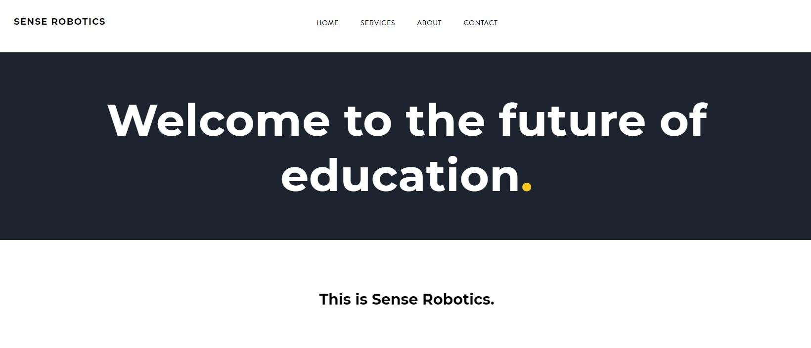
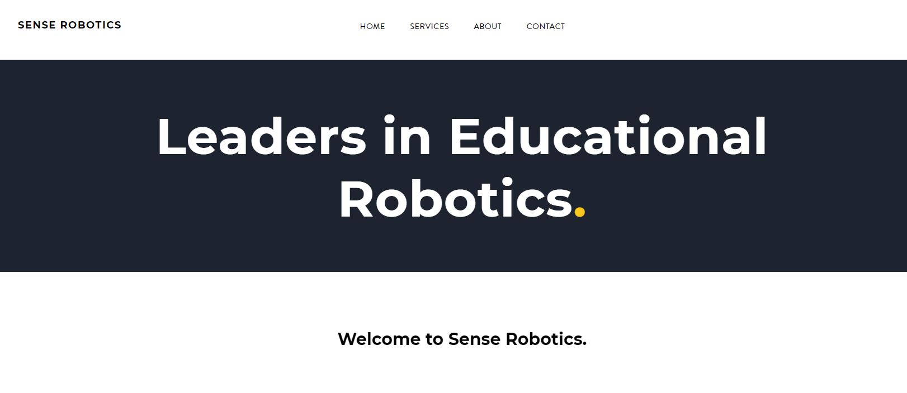

# A/B Testing
Hypothesis testing has many applications in the real world -- from clinical trials, to determining if a movie is 'significantly' better than the rest. While making decisions based on data in the business world, you will also need to be sure the patterns you observe are meaningful and reliable, and be able to quantify how confident you are in your estimates. This is where hypothesis testing can help.

One major application is A/B testing. This is where, broadly speaking, you collect data and want to decide which alternative to go with: A, or B. What those are specifically, will completely be dependent on the domain, and the task at hand. For instance, A and B can be logo designs, or two different treatments (or a placebo and a treatment), or new locations you want to open up in.

In this activity, we'll be using Python to conduct an A/B test together from start to finish.

## Brief
You have been hired by Sense Robotics Ltd, a tech education company that builds small robots to aid the learning of children below the age of 10. Sense Robotics is also completely fictional.

Despite having 'robotics' in their name and the aura they give out, they are actually not very data-driven. So far they have made their decisions entirely based on experience and gut feeling. One such decision on their minds right now is their home page design.

They have two options: A and B. The options are only different in the language used; not much else is different. Here they are:

  **Design A**.

  **Design B**.
  

Because of the nuanced differences between the two, the leaders of the business are not sure which option to go with. They do know one thing though: they want their customers to stay as long as possible on their home page. The more attractive the home page design, the longer the users will stay on the page, and the more likely they will browse the rest of the site. The longer they browse, the more likely they will add things to their carts and/or call for a quote.

In short, Sense Robotics Ltd. want you to investigate the relationship between the home page design and the amount of time users spent on their site.

## Designing the experiment
In order to investigate this relationship, you need to appropriately set the an experiment. This experiment has to specifically test whether using design A or B, has a significant effect on browsing time. To ensure your test is robust against other factors like gender, location, and age of the visitor, you will begin by taking completely random samples.

Specifically, you will need two random samples:
1. A random selection of users who _only_ saw design A. And,
2. A random selection of users who _only_ saw design B.

> It's critical that users only see the design they are supposed to see! If they see both, then it would be very difficult to assess the effect that each design specifically and uniquely had on user browsing time.

### Sample Size
As the analyst conducting this experiment, one incredibly important question you should ask is: how many users are we testing this on? How big are our samples?

From a statistics perspective, to answer this question we would need to explore related concepts such as how much statistical power we want in our experiment, and how big the effect size we're looking detect is.

> See the [third section](./theory/theory3.md) of the theory activity to review what power and effect size are and how they relate to sample size.

However, the answer to this question isn't necessarily straightforward, as it doesn't always come back to purely statistical decisions, but also the business. How many users we will run our experiment on very much depends on the traffic Sense Robotics' website receives, as well as -- whilst this is not the case here -- the particular segment of their customer base that the company is targeting.

We will revisit how to answer this question in the [last section](5_power.md), but for now, we can treat it as if it has already been answered appropriately -- both from a statistics and a business perspective.

### Time

Another important aspect you need to account for is the time the experiment will span -- for it will have to come to an end at some point, in order to make a conclusive decision.

As with the sample size, deciding on how long the experiment will run can be based on a combination of both statistical, and business reasons. From a statistics perspective, time span will of course affect sample size -- the longer we keep it running the bigger our samples will be. From a business perspective, this will primarily depend on how quickly the company wants to make its decision. Are they willing to sacrifice time for a bigger sample size, and therefore a more robust decision? Or do they need a quick decision as soon as possible, with the caveat that this will be less reliable down the line?

When you asked this question, the Head of Design at Sense Robotics mentioned this was an objective for Q1 of 2020 -- i.e. January to March. Therefore, the experiment will begin on 01/01/2020 and end on 31/01/2020.

### Other variables
The two main variables of interest are of course our design -- i.e A or B -- and how long the user spends on the webpage. In more technical language, the design variable is called our *independent variable*, or the variable that we will change ourselves. Browsing time then would be our *dependent variable*, or the variable that will vary depending on design.

Beyond those two primary variables, which are all that is needed to run the test and make a decision, we could also bring in some other features that could open up further research avenues. For instance, does the gender of our user affect how long they spend on our website? Perhaps their location? Or maybe if they are browsing our site on a weekday or a weekend? We could choose to address such questions, if we manage to collect those features -- accurately -- as part of the sampling.

In light of thinking ahead to addressing other interesting questions, we decide to capture the users' gender, continent in which they are connecting to our site, and the specific date and time at which the browsing session occurred.

## Research question
Now that you've been briefed, the company is leaving the rest up to you. You begin the statistical pipeline with a research question.

Whilst there of course can be more than one valid research question for this problem, it has to abide by the following basic parameters:

1. It has to be clear. Since it's expected that other people at Sense Robotics will be reading your research, it's important that your question clearly indicates the purpose of the analysis.

2. It has to focus on the two variables in question. From the statement, it has to be clear which variable is the independent, and which is the dependent.

3. Not mention 'Why'. Questions like _why are people spending more time on this design than that design?_ is an open-ended question, and probably has many answers. Keep in mind that we are _only_ testing the relationship between the variables of interest, and nothing else!

## Challenges

- [ ] Open up a blank Jupyter Notebook.
  - [ ] Name the notebook appropriately.
  - [ ] Create a heading, called `Brief`. Underneath, explain the problem at hand.
- [ ] Write down a valid research question for this problem.
- [ ] Create a new heading called `Libraries` and run the following imports:
  - [ ] `import pandas as pd`
  - [ ] `import numpy as np`

***
> If you get stuck doing any of the above challenges, then don't you worry! It's part of the learning process.   
Depending on the nature of the problem, we recommend using the following resources to aid you: 
>  1. Your notes from the workshop, where appropriate.
>  2. Google. Especially for debugging.
>  3. Your mentor. Especially for help on the more challenging concepts (e.g. p-values!) and debugging library installation issues.
>  4. The appropriate stage in the [walkthroughs](./walkthroughs/0_brief.md).
>  5. The completed notebook. Don't jump straight to this one; it should be your final resort!  

***

## Resource library

### Essential
[Research questions:](https://www.scribbr.com/research-process/research-questions/) An article describing the do's and don'ts of different types of research questions. 

 

___
[Next](1_reading.md)
