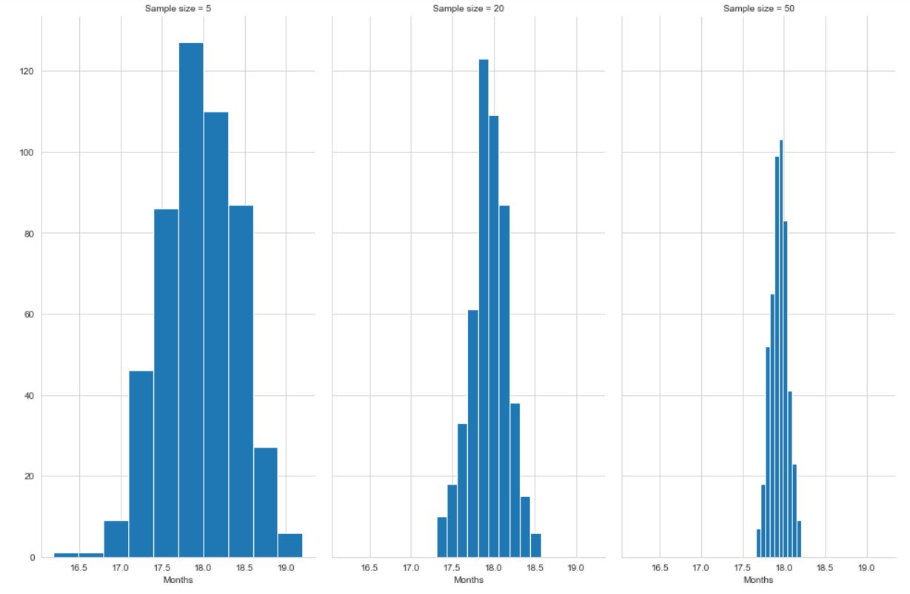
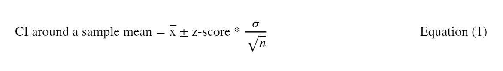
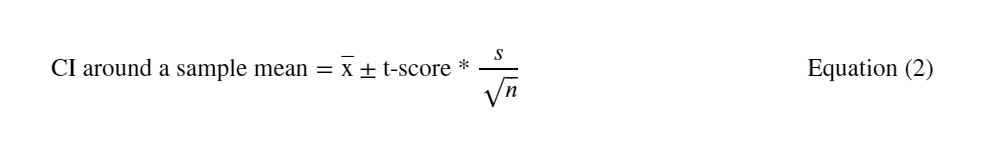
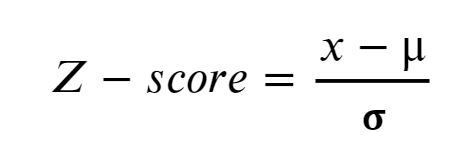
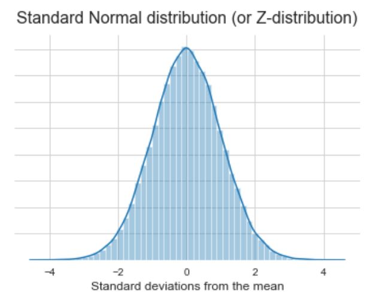
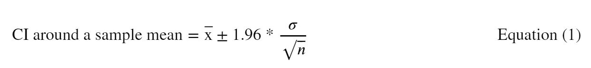
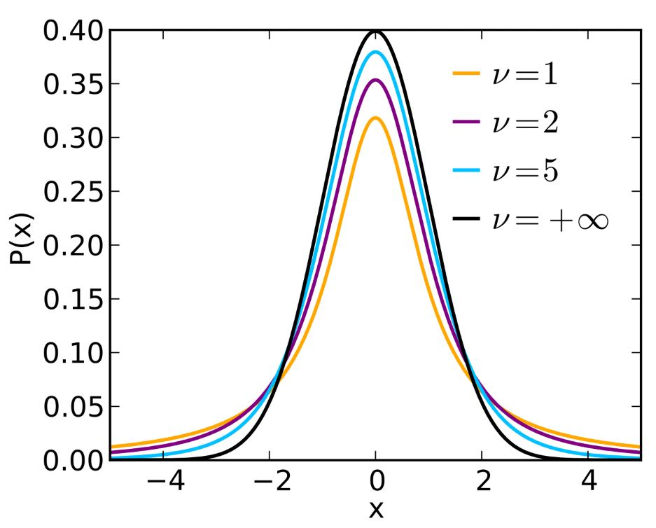
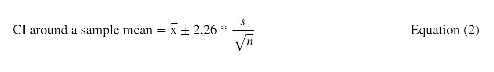

# Part 1: Sampling, the Central Limit Theorem and Confidence Intervals
In this first section we will explore the idea of making estimates with samples, by looking at sampling distributions, the Central Limit Theorem, and making range estimates with confidence intervals.

## Learning objectives
* Define the sampling distribution and explain its relation to sample size.
* Explain the Central Limit Theorem and appreciate its importance.
* Explain confidence intervals, why we use them, and how they can be generated.

## Population and Sample Statistics
When we analyse the world around us, we typically do so by using _sample statistics_. Sample statistics (such as the mean) are calculated after a _sample_ has been generated by taking a subset from the larger _population_ of interest. The _population_ can be a larger dataset, or it can be theoretical (you can imagine instances where it’s impossible to know the entire population you’re interested in).

> There are various ways by which we can draw components of the population into a sample population so that it is representative of the larger population. We won't go into the details here (link in further reading section) but it's vital to ensure representativeness (or at least know the limitations of our sample) because we might end up making important decisions based on samples.

> **Definition**: A *statistic* is simply a metric - like the mean or the standard deviation.

#### Two main ways of sampling

Whilst there are [many sampling strategies](http://dissertation.laerd.com/sampling-strategy.php) we can choose from, broadly speaking we can categorise sampling into two main buckets:

1. *With replacement*, or when the sample is 'placed back' in the population, giving it the same probability as before to be picked again,  
2. *Without replacement*, or when it's not 'placed back', slightly changing the probability of it being picked again.

### Sampling distributions
When we take multiple samples or resamples from a population, we get the frequency distribution of a sample statistic -- this is called the _sampling distribution_.

The standard deviation of that sampling distribution is called the *standard error*. When that sample statistic is the sample mean, then we call this particular case of standard error, the *standard error of the mean*.

Let's take an example to better understand these concepts.

***
<u>**Case study**:</u> Promotion rate at our company

Let's say for instance, we wanted to investigate the number of months it takes our employees to get promoted on average. To do this, we could try to get all historic data for all employees and track the months it took each of them to get promoted, which would be time consuming, and potentially difficult to obtain. Instead we opt to take a random sample of say 500 employees from the HR database. Our *sample size* here is 500.

Note that the fact it is random means our sample employees could be of any seniority level, from any department, they could be all females or all males, or some mix of both; in other words, when we take a random sample all features but the one we want -- promotion rate -- do not matter. From our random sample we then calculate the average and it turns out to be 15 months. This is called our *sample mean*.

We could stop here. After all, we have our estimate of 15 months. However, this is just based off of on random sample: it could be very close to the actual promotion rate average of our entire employee database, or it could be very far off. So the question is: how do we know how far away we are? Currently, we don't! We've taken one estimate only -- called a *point estimate* -- but we can make this more robust, by taking more samples (called *resamples*).

Let's say we take 100 resamples, again each of which has a size of 500. Now for each resample, we have a new sample mean, which may or may not be the same as our first sample mean. At the end of this activity, we will effectively end up with 100 sample means.

Now what would be interesting to see is how these sample means are distributed -- i.e. do we have a big spread for example? Where does 15 months lie in this distribution? We can answer those questions by plotting our sample means on a frequency histogram -- called a *sampling distribution*. Like any distribution then, this will have its own mean and standard deviation (called the *standard error*). In this instance, we might also call the latter the *standard error of the mean* since we have a sampling distribution of means.

To make our estimate more robust, we could also do a few other things. For example we could increase the sample size - if our organisation hires tens of thousands of people say, a sample of 500 may be quite small! We could also look into constructing what are called "confidence intervals" which would give us the range of values within which we can expect the *actual* mean promotion rate of our entire employees base to be. In other words, they would give us a *range estimate* rather than the *point estimate* we currently have.

We'll revisit both those ideas in the sections below.

***

### The effect of sample size
Increasing sample size has two observable effects, both of which affect the shape of our sampling distribution.

#### Less dispersion
First, the bigger our sample, the closer our sample mean is likely to be to the actual population mean, because we're capturing more of the data in our estimate.

> After all, if we increase the sample size to the population size, then our sample mean will be the same as the population mean!

***
Referring back to our case study, if we had an original population size (the total number of employees) of 10000, then finding the mean promotion rate of a sample of just 500 isn't likely to give us a good estimate of the actual mean. Taking the mean of a sample of 5000 employees however, is far more likely to give us a better estimate.
***

Now let's say as before, we take several resamples to form a sampling distribution. For a bigger sample size, since each sample mean will be closer to the actual mean, there's less chance of getting sample mean values that are very far off, or are sporadic. Therefore, we find that the sample means are quite tightly clustered together and there's little variance in the sampling distribution.

Contrast that with much a smaller sample size, where there is a much higher chance of getting a sample mean that is very far off from the actual population mean. For small sample sizes therefore, we end up seeing wider sampling distributions, with greater variance.

Mathematically, the relationship between standard error and sample size is expressed as follows:

Where, `n` is the sample size.

From the equation, we find that if we increase sample size, n, the standard error decreases (assuming a constant population standard deviation), thereby making our sampling distribution narrower.

> The above formula assumes we know the standard deviation of the population. In many cases however, we don't, so we end up estimating it.

Referring back to our example, we had a sample size, n, of 500. If we did several resamples (in our case 100) of a sample of 500, the shape of our sampling distribution, would be far wider than if we did the same with a sample size of say 2000. Likewise, our distribution will be far narrower than if we took resamples of a sample size of 50.

**Fig.1** - *Three sampling distributions with varying sample sizes -- a sample size of 5 on the left, 20 in the centre and 50 on the right. As we increase the sample size, the dispersion in the distribution -- i.e. the standard error of the mean -- decreases.*

As the sample size grows, we also see another phenomenon in action, called the Central Limit Theorem.

#### The Central Limit Theorem (CLT)
The Central Limit Theorem says that, provided the sample size is large, the sample distribution of means will look normally-distributed, or bell-shaped. In other words, *as we increase sample size, the sampling distribution tends to approximate the normal distribution.*

If the population itself was normally distributed, then this would not be a surprise. However, the fascinating thing is that this phenomenon exists even for non-normally distributed populations -- so long as they're not too departed from the normal distribution.

***
Referring back to our example, the CLT says that our sampling distribution of mean promotion rate will be normally distributed. Unless our population data is very skewed, or is very far from looking bell-shaped, we can expect our sampling distribution to be this way even before we collect any data!
***

Knowing this, is very useful for statisticians and analysts as it means we can now say, use statistical tests that make the assumption that the data is normally distributed -- like t-tests for example.

### Confidence intervals
With a big enough sample size, we say that our sample mean (x̅) approximates the population mean (μ).

> **Note on hypothesis tests** When finding the difference of the means of two samples, to test a hypothesis, we say that the first sample mean (x̅1) approximates that of first population (μ1), and the second sample mean (x̅2) approximates that of the second population (μ2).   
By extension, we say the mean difference _x̅1 - x̅2_ also approximates _μ1 - μ2_.The power of sampling means that whatever conclusion we end up making on the sample level -- accepting or rejecting the Null hypothesis -- we can generalise to the entire population!   
More on hypothesis testing in the [next section](theory2.md).

This estimate of μ -- or even if it's of μ1 - μ2 in the case of hypothesis tests -- is what is called a *point estimate*. Whilst this is a great start, as analysts we don't want to be putting too much faith in one single estimate. To make our estimate more reliable,  we might want to present it instead as a range of possible values. This would be called a *confidence interval*.

A range of values means we are accounting for uncertainty, or error in the estimate -- which is why a confidence interval is also often called *margin of error*. The interval is presented as the estimate itself plus and minus a certain value. For e.g. a sample estimate of the mean household income in the UK might be £25000 ± £1500 (as opposed to just a point estimate of £25000).

This is only useful however, when we specify what this interval means. If we wanted to be say, 95% sure (or 'confident') that our population estimate is within this interval, then we would construct a 95% confidence interval. The more confident we want to be of our estimate, the wider the interval will be.

If we run an experiment -- say, sampling household incomes in the UK -- 100 times (i.e. 100 resamples), the 95% confidence interval is the range of values within which we can expect our actual population value (i.e. mean household income) to lie in 95 of those experiments.

> **Confidence levels vs. Confidence intervals** 
These two concepts are quite often confused -- and perhaps rightfully so, as they're very closely related.  
A _confidence level_ is how confident we want to be of something -- i.e. a percentage, say, 95%. In hypothesis testing, we mention confidence levels with significance levels when we decide on our threshold or the goalpost for our test (see next section for more details). Within confidence intervals, the confidence level is simply how confidence we want to be that our estimate approximates the population value.   
A _confidence interval_ is our range of values, i.e. the range estimate itself.  
E.g. if we say that the 95% confidence interval for our sample estimate of UK household income is £25000 ± £1500, then the interval itself is the range of values (i.e. £23,500 to £26,500) and the confidence level is simply 95%.

#### Constructing a confidence interval
For an estimate of a sample metric -- say, the sample mean -- we can construct intervals in one of two main ways.

> *Note before we begin:  It's more important to understand conceptually what confidence intervals give us than how to calculate them. Unlike in academia and research, as a data analyst or data scientist, CIs are a tool often used to understand how variable a sample estimate is, and thus how confident we are in it. We could then use that when making or critiquing business decisions basded on estimates, or when we communicate those estimates to stakeholders.*

First, there is the slightly more intuitive way, which involves *sampling with replacement* (also called *bootstrap sampling*), and there's the traditional 'statistics textbook' way, which uses formulas, especially those related to the *t-distribution.* We are going to address both.

##### 1. <u>**Method 1**</u>: Bootstrap Sampling
This process follows six steps. Given a sample size of *n*, to construct a confidence interval for a sample estimate, we [1]:

1. Draw a random sample of size n, with replacement, from the data.
2. Record the statistic of interest -- for e.g. the mean -- for this sample.
3. Place the sample back and repeat this process *M* times.
4. Plot the distribution of the sample means. This is our sampling distribution.

>Recall that our sampling distribution will most likely resemble the Normal distribution (due to the central limit theorem). Our confidence interval will therefore cover the central peak of the 'bell' (i.e. the mean) and some area to the right and the left of it.

5. For 95% confidence interval, we want the mean of our sampling distribution (the peak of the bell) plus/minus some region to the right and left of that to cover 95% of the total area. This means we need to trim 2.5% from either end of our sampling distribution.

> More generally, for an x% CI, we trim [(100-x)/2]%.

6. The points where we've trimmed are the *lower and upper ends* of our bootstrap confidence interval.

> We can calculate what those lower and upper points are by calculating the value on the distribution that corresponds to the 2.5th percentile (for the lower bound) and 97.5th percentile (for the upper bound).

##### 2. <u>**Method 2**</u>: The statistics textbook way
Up until recently, we did not have the computational power to run multiple bootstrap samples as per the above method. Instead, statisticians traditionally resorted to using various formulae and tables to generate intervals.

> <u>Note</u>: This section can be slightly more challenging than the other elements of the module.   First, it's quite heavy on the maths. Specifically the use of various formulae in different situations for example, or navigating z-tables and t-tables can be a source of confusion for many -- it may be why statistics gets a bad reputation!
  The good news is in reality, you can rely on bootstrap sampling (method 1) because we now have the computational power. However, for the sake of furthering our grasp on the field, understanding how it used to be done for a long time -- and covering all necessary material as per the Apprenticeship standard -- it's important that we explore this method as well.   
We will try to keep it as light and as relevant as possible -- as there is a plethora of scattered and oftentimes irrelevant content online. We will also link to some external resources for those of us who want to dive even deeper!

To calculate confidence intervals we need to use one of two equations.

If we know the population standard deviation, *𝛔*, then we use this equation:  

However, if we don't know it in advance -- which is quite often the case -- we opt for the following equation using the sample standard deviation, *s* instead.

Where:
- *n* is the sample size,
- *𝛔* is the standard deviation of the population,
- *s* is the standard deviation of the sample,
- *z-score* and *t-score* are values we can obtain from the z-distribution and t-distribution respectively (discussed below).

##### <u>On Z- and t-values</u>
If we wanted to find how far away a data point is from the mean, we might just take the difference between the two. However, we would still not know how this difference compares to the rest of the data points -- i.e. how far is this data point from the mean _relatively_?

This is where the *z-value*  (also called z-score) comes in. It gives us a measure of how far a data point is from the mean in terms of the _number of standard deviations_. In other words, it _standardises_ the distance between our data points and the mean. A z-score of 1 for example, means the data point is one standard deviation away from the mean.

> Converting an absolute difference between a data point and a mean to a z-score is called normalisation, or standardisation.

To standardise a data point, we simply find the difference between it and the mean of the population, then divide by the standard deviation (of the population), i.e.:

  **Equation 3** -- *Converting an x value to a z-score*.

Where,
- `x` is our data point.
- `μ` is the mean of our population.
- `𝛔` is the standard deviation of our population.

Now, with z-scores we know how far off each data point is from the mean, relative to other data points. In some scenarios, it may be useful to apply this to every data point. Applying this formulae to every data point on the normal distribution for example -- i.e. the 'bell' curve -- is particularly useful.

The graph below is still the normal distribution -- nothing has affected the shape or the properties of the distribution -- but the X-axis has now been standardised and the values are represented in terms of units of 𝛔. When we have the normal distribution in this form, we often call it the *standard normal distribution* or the *z-distribution*.

 **Fig. 2** -- *The standard normal distribution*.

> Note that the mean of the z-distribution is 0. This makes sense because 0 here means 0 standard deviations from the mean! Note also that the standard deviation of the z-distribution is 1. In other words, the z-distribution is a specific form of the normal distribution where the mean = 0, and 𝛔 = 1.

Recall, that one of the properties of the normal distribution -- sometimes called the *68-95-99.7* rule -- is that 68% of the data in the distribution is captured within 1𝛔 of the mean, about 95% is captured in 2𝛔 of the mean, and almost all the data (~99.7%) is captured within 3𝛔 of the mean. The z-distribution shows us this.

Therefore, if we care about an interval that covers ~68% of the data, then our z-score will be 1. Likewise, if we want an interval that covers ~95% of the data -- in other words, a 95% confidence interval -- we will want a z-score of ~2 (more specifically, 1.96). But beyond this general rule, what if we are after any other confidence value? For that, we use *z-tables*.

 
**Table 1** -- *An example z-table [2]. First note that each row represents a z-score, specifically its units and tenths (first decimal place), and each column represents the value of the score in the hundredth position (second decimal place). The cells in the z-table above represents the area under the z-distribution curve -- or the probability. Note also that this form of a z-table shows us only the positive half of the curve (the region to the right of the mean, 0)*.

Let's take an example to better understand how to use the table above. Let's say, we're interested in generating a 95% confidence interval for our sample mean. Recall that the 95% region will cover the middle 'bell' as well as a region to the left and to the right -- equal regions on both sides since the distribution is symmetrical. Our aim is to find the upper  bound, to the right of the curve, and the lower bound to the left of the curve.

The cells in Table 1 above represent the area under the curve "between the mean and the z standard deviations above the mean" -- i.e. the positive half of the curve, to the right of the peak. Covering the middle 95% region of the graph means we are trimming 2.5% from both ends -- the value at each end is our bound (upper or lower). For 95% confidence, this means we're eyeing 47.5% (or 0.475) on either end of the peak.

Since the table above only shows us the positive half of our distribution, we can only get the upper bound. If we look for 0.475 in the table, we'll find that it corresponds to row value _1.9_ and column value _0.06_ (try it for yourself!), which together make a z-score of 1.96.

Now all we need to do is plug it in our equation and add/subtract it to get the upper/lower bounds of our 95% confidence interval. I.e.

  **Equation 1** -- *The same equation 1 above, but with 1.96 as our z-score to get a 95% confidence interval.*

1.96 is commonly used because we commonly want the 95% confidence interval by convention. Table 2 below shows some other common confidence levels and their corresponding z-score values.

| Confidence | Z-score |
| --- | --- |
| 80% | 1.28 |
| 85% | 1.44 |
| 90% | 1.65 |
| 95% | 1.96 |
| 99% | 2.58 |
| 99.5% | 2.81 |
| 99.9% | 3.29 |

**Table 2**:_Some commonly used confidence levels, along with their corresponding z-scores._

In summary, the steps for generating the CI for our sample mean using Equation 1 below are:
1. Obtain sample mean, `x̅`.
2. Square root the sample size, `n`.
3. Divide the population's standard deviation, `𝛔` by our result from step 2.
4. Obtain the z-score from a z-table.
5. Multiply the z-score with the result from step 3.
6. To get the upper bound: add the result from step 5 to the sample mean.
7. To get the lower bound: subtract the result from step 5 from the sample mean.

##### T-values?
Z-scores are useful of course, but we still have one major problem: more often than not, we do not know the population standard deviation, which means we cannot use equation 1 above.

Instead, its close cousin the *t-score* is used. Sometimes, we may also have a very small sample size (usually 'small' means n < 30), in which case again we cannot use the z-score and instead opt for the t-score.

> Calculating the z-score requires _two conditions_ to be met: a samples size, n, that is greater than 30, _and_ for us to know the population standard deviation, 𝛔.

If one of those conditions is not met, it is safer to use t-scores instead (equation 2 below).

Specifically if the sample size is very small, we cannot even assume that the data is normally distributed -- recall that the z-values lied on the z-distribution, which is effectively the normal distribution. Instead, for small samples we use what is called the *t-distribution* (also called *Student's T distribution*) -- a shorter, fatter version of the normal distribution.

In fact, the smaller the sample, the shorter and fatter it is. Since we can have many small sample sizes, we can also therefore have many t-distributions -- which is why they're sometimes called 'a family of distributions'.

Statisticians describe each of those different forms of distributions not in terms of sample size however, but more often in terms of a closely related concept called *degrees of freedom*. Broadly speaking, degrees of freedom can be seen as the number of data points that are free to vary in a dataset. In our case, this is simply calculated as *1-n* (where *n* is the sample size).

> **Understanding degrees of freedom**  
Degrees of freedom refer to the number of independent data points in a dataset. To better understand what this means, let's take a simple example.  
Let's say we wanted to choose 3 numbers that together have a mean of 5. For instance, 4,5,6 can be one set, or 0,5,10 could be another. If we do this exercise, we find that actually once we choose the first two numbers, the third one becomes fixed. In other words, we have two real choices to make, two data points we can vary freely; hence, 2 degrees of freedom.  
For doing things with one sample, as is our case here, the degrees of freedom are calculated with the formula: 1-n, where n is the sample size. For different applications however, for example those that involve two samples, the calculations vary slightly. For the purposes of this module, we don't need to dive deeper into this concept, but feel free to read further if you're curious!

 **Fig. 3** - *Different degrees of freedom result in different t-distributions.*

As the degrees of freedom - denoted by *v* here - decreases, the t-distribution gets shorter and fatter (also called 'heavy-tailed').

Calculating the degrees of freedom for our sample is important because it's one of two key pieces of information we'll need to get a t-score. The second piece of information is simply one of the 'ends' (or 'tails') we will trim by taking the confidence interval. In other words, for a 95% CI, this is 2.5% (or 0.025) on either end of our data.

> In statistics, the 'alpha' level is one minus our confidence level (1-CL). If we're taking a 95% confidence interval, then our alpha would be 0.05. Therefore when we talk about taking one of the 'tails' above, in technical terms we mean alpha/2.   Alpha is also referred to as a significance level, but we'll leave that concept for [Part 2](theory2.md).

Once we've calculated one of our ends and we have our degrees of freedom, we can then use a *t-table* like the one below to find the t-score.

 **Table 3** -- *A t-table with degrees of freedom as rows, and the alpha value as column. The cells represent the corresponding t-scores.*

For example, let's say we took a very small sample of 10 people, we found their mean height, and we now want to obtain the 95% confidence interval for our estimate. The degrees of freedom in this case would simply be 1-10 = 9, so we'll be eyeing the 9th row in Table 3 above. For a 95% confidence level, we will need to trim 2.5% at each end, or 0.025, and so we'll be eyeing the 5th column in Table 3. Following the table, this gets us a t-score of 2.262, which we then plug into Equation 2 below to find our upper and lower bounds.

  **Equation 2** -- *The same equation 2 above, but with 2.26 as our t-score to get a 95% confidence interval*

In summary then, if our sample size is very small (or we cannot assume a normal distribution for any reason) and/or we don't know the population variance, the steps for generating the CI for our sample mean would be:
1. Calculate the mean of our sample, `x̅`.
2. Calculate standard deviation of our sample, `s`.
3. Square root the sample size, `n`.
4. Divide the result of step 2 by that of step 3.
5. Calculate the degrees of freedom and alpha level and use those to obtain a t-score from a t-table.
6. Multiply the t-score with the result from step 4.
7. To get the upper bound: add the result from step 6 to the sample mean.
8. To get the lower bound: subtract the result from step 6 from the sample mean.

## Resource library

### Optional support

#### On sampling
[Sampling strategies:](https://www.khanacademy.org/math/statistics-probability/designing-studies/sampling-methods-stats/a/sampling-methods-review)
This resource by Khan Academy offers a comprehensive overview of different sampling strategies. 

#### On the CLT
[An article on the CLT:](https://statisticsbyjim.com/basics/central-limit-theorem/#more-3781)
This blog post provides an intuitive and graphical explanation of the CLT.

[An other overview of the CLT:](https://sphweb.bumc.bu.edu/otlt/MPH-Modules/BS/BS704_Probability/BS704_Probability12.html) 
This resource sheds some light on sampling from binary and skewed distributions. It is an extract from Boston University's probability course.

#### On confidence intervals
[The basics of confidence intervals:](https://www.mathsisfun.com/data/confidence-interval.html)
This article from Maths is fun provides an intuitive explanation of how confidence intervals are calculated and plotted, with the possibility to visualise them as wel.

[How to generate CIs in Python, Machine learning mastery:](https://machinelearningmastery.com/confidence-intervals-for-machine-learning/)
A great Machine learning mastery article explaining a possible methodology to implement CIs in Python.

[Some video content on CIs:](https://www.khanacademy.org/math/statistics-probability/confidence-intervals-one-sample) 
A useful set of videos as part of a Khan Academy course on margins of error, interpreting and constructing CIs. 

[Degrees of freedom:](https://www.statisticshowto.com/degrees-of-freedom/)
A Statistics How To article explaining the concept of degrees of freedom. 

### Optional stretch
*  [Practical Statistics for Data Scientists: 50 Essential concepts:](https://www.amazon.com/Practical-Statistics-Data-Scientists-Essential/dp/149207294X) A book covering must-know concepts in statistics for data science. 

* [An article on Z-tables:](https://socratic.org/questions/how-do-you-find-the-area-under-the-normal-distribution-curve-to-the-right-of-z-3) Another article discussing Z-tables and how to read them. 

   

  ___
  [Previous](theory-intro.md) |  [Next](theory2.md)
