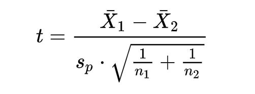
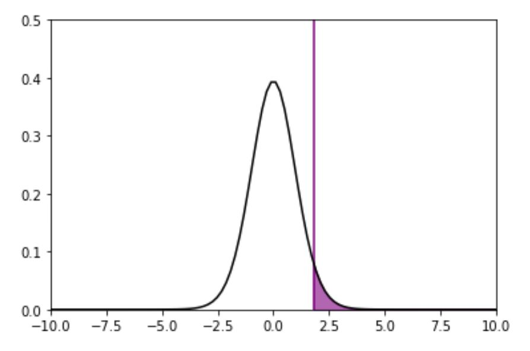
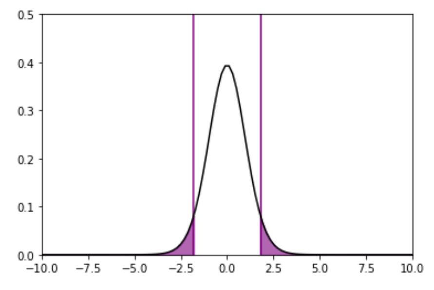
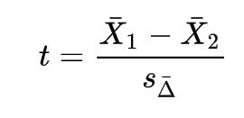
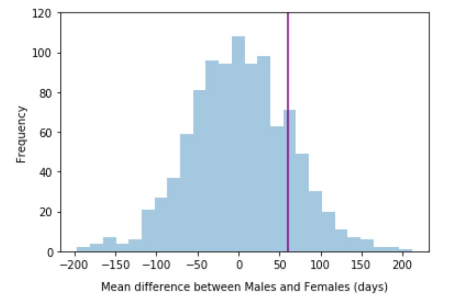
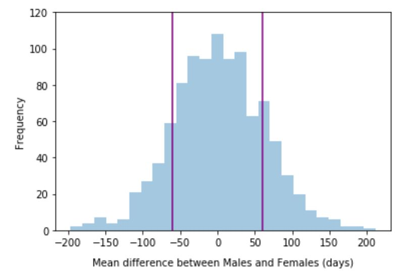

# Part 2: Hypothesis testing
In this section, we'll be diving deeper into hypothesis testing theory, by refreshing the methodology we're already familiar with from the workshop as well as building on it with some new concepts.

## Learning objectives
* Recap, explain and interpret the Null and Alternate hypotheses that test the difference between two sample means.
* Explain and interpret significance levels, confidence levels, and p-values and their use in statistical tests.
* Explain the difference between parametric and non-parametric hypothesis tests.

## An overview
Hypothesis testing is the formal way to test if a pattern we observe -- say, the difference between two means for example -- is within the realm of chance, or if it is considered 'statistically significant'.

To formalise a hypothesis test, we need two hypotheses: a *Null* and an *Alternate*, denoted as H<sub>0</sub> and H<sub>1</sub> respectively.

- **Null Hypothesis, H<sub>0</sub>**:<br>
This hypothesis states that our result is due to chance, or is within the realm of chance. We come into the analysis with the assumption that the Null is true.

- **Alternate Hypothesis, H<sub>1</sub>**<br>
This states that our result is indeed statistically significant -- for example, the difference between the means is so extreme that it could not possibly be due to chance (with respect to a certain significance level).

Only after the analysis, we make one of two conclusions:
  - Either we *accept the Null*, or more technically we _fail to reject the Null_. Or,
  - We *reject the Null*, if the result proves to be statistically significant.

> We assume any result we observe is due to random chance until proven otherwise. In other words, we assume the Null the hypothesis is true, until we get strong enough evidence to reject it. Because of this, we technically either reject the Null (thereby 'accepting' the Alternate) if we have strong enough evidence to, or we fail to reject the Null (thereby 'accepting' the Null) if we don't have enough evidence to.<br><br>
You can think of accepting randomness until proven otherwise, as analogous to assuming innocence until proven guilty, in a courtroom.

<br>
Hypothesis tests are not new conceptually, are still very much applied to this day. To name only a few examples:<br>

|Application|Example Null Hypothesis |Example Alternate Hypothesis|
|---|---|---|
|Drug treatment|Drug A and drug B have the same effect on patients|Drug A is statistically significantly better than Drug B|
|Churn reduction|There is no statistically significant difference between churn reduction of campaigns A and B|There is a statistically significant difference in churn reduction between campaigns A and B|
|Machine learning model accuracy|Model X does not predict better than the existing model|Model X predicts better than the existing model|
<br> <br>

**Table 1** -- *Some examples of hypothesis tests in the real world*.
<br>


> **One-way vs. Two-way**<br>
Note that hypotheses can be either one-way (or one-sided) or two-way (or two-sided). Whilst the former cares about direction -- i.e. Drug A is significantly _better than_ Drug B -- the latter does not -- i.e. there *is* a significant difference between the effects of Drugs A and B, but we're not concerned which is better.<br><br> For this reason, two-way hypotheses are sometimes also called bidirectional, and one-way hypotheses, uni-directional. Which alternate hypothesis you will test for will depend on what you want to get out of your test.

<br>

### Statistically significant?
Recall that we reject the Null if the result we get is deemed 'statistically significant'. But how do we determine that? This is where the *significance level* comes in.

You can think of it as setting our goalpost; it tells us how 'significant' our value must be in order to reject our Null hypothesis.

This is an arbitrarily chosen value -- usually however, it's common to choose an SL of 0.05 (or 5%). Once we get our p-value later on, this is what we will compare it to.

Closely related is the concept of a *confidence level*, which answers the question: how confident do we want to be of our result? In fact, a confidence level is equal to 1-SL. In other words, an SL of 0.05 corresponds to a confidence level of 95%.

> Since they're so closely related, we can infer one of the values from the other. Stating a SL of 0.05 initially, means that whatever conclusion we end up making -- i.e. accept or reject H<sub>0</sub> -- we are making with 95% confidence.

The lower we set our SL, the higher our confidence level, and the stricter we are in our test. This is important in say, the medical and forensics fields, where we want to be very sure of say, a new treatment's effectiveness. It's not uncommon to see confidence levels of 0.999 for example (significance levels of 0.001).


### P-value
As always we initially assume by default that the Null hypothesis is true. Given that assumption that the Null is true, the p-value is then *the probability of obtaining results that are as extreme as or more so, than the observed results.*

> The p-value is a probability.

For example, let's say we get a p-value of 0.1. This means, assuming the Null hypothesis is true, the probability of obtaining a result as extreme as the result we obtained is 10%. In other words there is a 10% chance of getting this result if the Null is true. This is a low probability, generally speaking, so at first glance we may think this is an extreme result, and is unlikely to be due to random chance. But we haven't defined 'extreme' yet - how do we know if the probability is low enough?

This is where our threshold, the predetermined SL, comes in. If the probability of getting the result we got (or anything more extreme than it) is greater than our SL, then we say -- even if it is very low -- that the result is _still within_ the realm of chance, and so we accept the Null hypothesis. Conversely, if we get a probability that is so low, that it's even lower than our SL, then we can confidently -- precisely with 95% confidence if we set an SL of 5% -- reject the Null hypothesis.

Therefore, when we compare our p-value to our SL, we have one of two outcomes:

1. **p-value >= SL**. If this the case, we *accept the Null hypothesis* - or *fail to reject the Null hypothesis*.
2. **p-value < SL**. If this the case, we *reject the Null hypothesis*.

> When we state our conclusion, be it to accept to reject the Null, we also state the confidence level.<br><br> For example, let's say we had set an SL of 0.05, and we ended up with a p-value of 0.03. Since the p-value < SL, we reject the Null. When we write up our conclusion we might say something like "We reject the Null that...[state what the Null says]...with 95% confidence." Mentioning the confidence level also implies our SL was 0.05 (which of course is a key piece of information).

This is the p-value conceptually. There are a few ways to calculate it, discussed in sections below. Broadly speaking though, we can use either methods based on formulae (if we're using a formula-based statistical test), and or we can generate through permutations (discussed in the permutation test section below).

> **<u>P-hacking</u>**<br><br>: It's important _not_ to change the target SL value after running the test --  as that would be similar to changing the position of the goalposts after kicking the ball. Once we've determined our SL, we stick with it until we calculate the p-value and make a decision accordingly.


## Difference of means  
There are many types of hypothesis tests. In fact, there are also quite a few ways we can group those types.

One such way is by the test's function or purpose. To name only a few, there are:
- Those that test for correlation between numerical variables,
- Those that test the significance of relationships between categorical variables,
- Those that test the difference between the medians of two groups, and
- Those that test for the difference in the means of different groups.

Within this module, we will only be focusing on the latter: *testing the difference between two group means.*

> The 'difference of means' hypotheses essentially tests whether the difference between two population means is due to chance (Null) or is deemed statistically significant (Alternate).

Even within the 'difference of means' category, we have several tests! Which test we choose will depend on our situation. Some things to consider for instance are:
- Are we dealing with two samples only, or more?
- Are the samples independent of each other, or not?
- Are the variables we're testing continuous or discrete?
- Are our samples normally distributed or not?

> We run tests on samples generally because it is not feasible to run them on the actual population -- due to cost, time, or lack of access for example. However, it's important to remember that whatever decision we end up making at the sample level, we are extending to the entire population -- that is power (and point) of sampling!

When running such a test, we end up dealing with the following parameters:

|Population parameter |Symbol|
|---|---|
|Mean of population 1|μ<sub>1</sub>|
|Mean of population 2|μ<sub>2</sub>|
|Standard deviation of population 1|𝛔<sub>1</sub>|
|Standard deviation of population 2|𝛔<sub>2</sub>|

However, since we don't usually know all (if any) of the population parameters above, we use sample parameters instead:

|Sample parameter |Symbol|
|---|---|
|Mean of sample 1|x̅<sub>1</sub>|
|Mean of sample 2|x̅<sub>2</sub>|
|Standard deviation of sample 1|s<sub>1</sub>|
|Standard deviation of sample 2|s<sub>2</sub>|
|Sample size of sample 1|n<sub>1</sub>|
|Sample size of sample 2|n<sub>2</sub>|


> **Note on Apprenticeship Standard**<br>
Within the 'difference of means' category, the majority of our focus will be on testing the difference between _two independent_ samples only. We will lightly touch on scenarios where we have multiple groups or samples, but there will be plenty of other scenarios (e.g. where samples are dependent on each other) that will sit beyond the scope of this module. If you're interested, and we encourage you to keep learning, the Further Reading section will link to a couple of helpful external resources.


### Parametric vs. non-parametric tests
We mentioned one way to think of statistical tests is by their function or purpose. Another way is to think of them as either *parametric tests* or *non-parametric tests*.

Parametric tests make an assumption about the underlying population distribution -- i.e. about its parameters. For example, the Student's t-test (described below) assumes the populations are normally distributed. Therefore, in order for us to use this test -- and reach valid and appropriate conclusions -- we need to have met this requirement.

Interestingly, we could also meet it if we're dealing with a distribution of resamples (i.e. a sampling distribution) for example. Recall that the Central Limit Theorem states that as the number of resamples increase, the sampling distribution tends to the normal distribution --- even if the original population is not normally distributed.

> Revisit [Part 1](theory1.md) for a refresher on the Central limit Theorem and the Student t's distribution!

Non-parametric tests on the other hand, do not make any assumptions about the underlying population distribution. Examples include the Mann-Whitney U test, and permutation tests, both of which are mentioned in sections below.

> Permutation tests specifically are quite practical because we don't need to meet various assumptions other tests need - e.g. the data can be numeric or binary, the sample sizes can be different, and of course we don't need the data to be normally distributed. For those reasons, it's been described as being really close to a 'one size fits all' test. However, they are more computationally expensive to run than more traditional tests, which is why they have only become a practical option in recent times.

We will go through two examples of each -- parametric and non-parametric -- step-by-step to get a firmer understanding of how they work.

### Step-by-step
More often than not, we would first check which test is most appropriate based on its type then check its assumptions against those we can safely make based on our data. Then, we will generally go through the following basic steps:

1. State the Null and Alternate hypotheses. These will be different depending on the purpose of the test of course, but here we're only exploring those hypotheses that address differences in sample means.

2. Calculate the sample metrics -- i.e. the sample means (_x̅<sub>1</sub>_ and _x̅<sub>2</sub>_), and the sample standard deviations (_s<sub>1</sub>_ and _s<sub>2</sub>_).

3. From those metrics, use the appropriate equation to calculate the *test statistic*.

4. Calculate the probability of getting a value as extreme as our test statistic. This is our p-value. You can think of this probability as the appropriate area under our distribution curve. More on this below.

5. Compare our p-value to our significance level. If our p-value is above or equal to the significance level, we accept the Null hypothesis; if on the other hand, it's smaller than our significance level, we reject the Null hypothesis.


#### Student's t-test
The first test we will explore is the Student's t-test, which tests whether the means of two independent samples are equal or not.

> There are a family of 't-tests' within which the Student's t-test falls. For instance, if we were instead interested in:<br><br>- Comparing a mean of one sample to some known value, then we would need a _one-sample t-test_, or <br><br>- Comparing the means of two samples that are not independent, then we might need a _paired t-test_.<br><br>
In this module, we won't be exploring the entire family of tests, just two of them that evaluate the difference between two independent sample means: Student's t-test, and later on, Welch's t-test.

The Student's t-test makes a few assumptions, which need to be met in order for us to use it. Those are:
1. It assumes that the samples are independent of each other -- i.e. the individuals for instance in one sample have no relationship with, or aren't affected by those in the other sample.
2. It assumes that the underlying populations of both samples, are normally distributed. This is the assumption that makes this test parametric.
3. It assumes that the two distributions have equal variance (and therefore equal standard deviations).
4. It assumes the dependent variable is continuous.
5. It assumes the independent variable has two categories.

***
**Note on practice**<br>
If all assumptions are met, and we decide this is the test for us, then we either do it by hand or with the help of code.

The purpose of this section is to look under the hood into the theory behind each test, to get a better understanding of how they work -- or how we would have done them a long time ago, before we had friendly programming languages and powerful computers -- so we will start with breaking down how we would do them manually.

In practice however, it may be assuring to know that almost each one of those tests that we will discuss is a simple one line of code. For e.g. the *t.test()* function in R and the *ttest_ind()* function in Python are all we need to execute a Student's t-test!
***

To better understand the steps of a Student's t-test, we will use an example. Let's say, we had a hunch that when it came to the number of years our employees stay at our company, gender mattered. To investigate this, we took a random sample of male ex-employees and a random sample of female ex-employees. We then took the mean years (or months) for each of our samples.

> **A note on technical terms**<br>Our _independent variable_ here (what we're changing) is gender; our _dependent variable_   (what we're testing) is the time spent at the company.

<u>**Step 1**: Formulate the Null and Alternate hypotheses</u><br>

Our **Null hypothesis** would say that there was no significant difference between the mean months for males and the mean months for females.

In other words, _μ<sub>1</sub>_ = _μ<sub>2</sub>_, where μ<sub>1</sub> is the mean of male population and μ<sub>2</sub> is the mean of the female population.


Our **Alternate hypothesis** can be phrased in a number of valid ways.

If we choose a two-way (or two-sided) hypothesis test, then we're saying we're not interested if male average stay was greater than female average stay, or vice versa. We're just interested *if there is a statistically significant difference* regardless of the direction that difference goes in.

If we opt for a two-sided test, then our H<sub>1</sub> is: _μ<sub>1</sub>_ ≠ _μ<sub>2</sub>_.

If on the other hand, we choose a one-way (or one-sided) hypothesis test, then we are *interested in direction*. I.e. we are interested in whether the average male months is greater, or in whether the average female months is greater.

If we opt for a one-sided test, then two valid alternate hypotheses could be:
1. H<sub>1</sub>: _μ<sub>1</sub>_ > _μ<sub>2</sub>_. Or,
2. H<sub>1</sub>: _μ<sub>1</sub>_ < _μ<sub>2</sub>_.

<u>**Step 2**: Set a signifcance level </u><br>
This again, is an arbitrarily chosen value, but it's important to set before we begin testing.

Let's say we go for an SL of 0.05. This means, whether we accept or reject the Null, we do it with 95% confidence in our decision.

<u>**Step 3**: Calculate the means and standard deviations of both samples</u><br>

In terms of notation, those are _x̅<sub>1</sub>_ for the mean of sample 1, _x̅<sub>2</sub>_ for the mean of sample 2, _s<sub>1</sub>_ for the standard deviation of sample 1 and finally, _s<sub>2</sub>_ for the standard deviation of sample 2.

<u>**Step 4**: Calculate the test statistic</u><br>
How we calculate this test statistic will depend entirely on the specific test we are running. In our case, for the Student's t-test with the aforementioned assumptions, the equation to calculate the t-statistic is:



Where, _s<sub>p</sub>_ is the combined (or 'pooled') standard deviation for both samples.

> We don't need to worry about the above equation too much (or that of the pooled standard deviation), we just need to be somewhat familiar with what each component means, in case we ever choose to run a Student's t-test by hand!

Let's say, just for the sake of continuing with our example, we get a t-statistic value of 1.8. It doesn't matter what our value is for now, just how we would use it.

<u>**Step 5**: Calculate the p-value</u><br>
Now that we have our t-statistic, the question is: how extreme is this value? I.e. what is the probability of getting a value such as this, or bigger? Mathematically, we denote this probability as *P(t > 1.8)*.

To help us answer this question, let's visualise the distribution of all values the t-statistic can take.

> The t-statistic follows the t-distribution (also called the Student's T distribution). Recall from the [previous section](theory1.md) that this is simply a shorter, and thicker version of the normal distribution.


<br> **Fig. 1** - *Our t-distribution. The shaded area represents the probability of getting 1.8 or anything greater.*

The above graph is our t-distribution, with the value of 1.8 being highlighted to the right of the graph. Visually, the probability of getting 1.8 or more on this distribution, is simply the area to the right of 1.8 (the shaded region).

Recall however, that we decided to go for a two-way (or two-sided) test. That means we don't care about direction the difference is going in -- be it positive (if for instance mean female time > mean male time) or negative (mean male time > mean female time). We just care *if* there is a difference between male and female time.

Therefore, just as we are interested in the probability of getting a value such as 1.8 or greater, we are also interested in getting a value of -1.8 or smaller. Both represent 'extreme' values for us since we don't care about direction, and both should be accounted for when calculating our p-value.

Visually, this means we care about both ends, or *tails* of our t-distribution, and thus, both shaded regions in Fig. 2 below.


<br> **Fig. 2** - *Shaded area represents everything greater than 1.8 (right) and everything less than -1.8 (left).*

Getting the area under both shaded regions then is our p-value. But how do we do this? There are two ways we can do this manually.

1. Use a calculator to get an *exact* p-value.
2. Use t-tables to get a *range* within which our p-value will lie.

> **Getting even more technical**<br>
What is most important is understanding the p-value at a conceptual level, and how we use it. In practice, as mentioned, one line of code is quite likely all you need to get a p-value, but if you wish to ever do this activity by hand, or if you want to delve deeper into the technicals then this subsection will help with that -- although note that for the Apprenticeship assessment, you will defitiely not be asked to do this! <br><br>
Essentially, to get the area under the t-distribution, we will need to _integrate_ the [very complex t-distribution function](https://mathworld.wolfram.com/Studentst-Distribution.html), which some calculators could do for us (option 1). To do the calculation, we will need to know our degrees of freedom -- recall that the t-distribution varies slightly with degrees of freedom, so knowing this is important. For a two-tailed test we will need to find the area under the left region -- by integrating until -1.8 -- and add that to the area of the right region -- which we can get by integrating until 1.8 and subtracting that from 1 (total area under the curve). <br><br>
Option 2 involves looking at t-tables (like [this one](https://www.sjsu.edu/faculty/gerstman/StatPrimer/t-table.pdf) for example), and navigating to the appropriate degrees of freedom first. If our dof = 25 for example, then we navigate to that row. Reading across, our value of 1.84 lies between 1.708 and 2.060. Reading up to the one-tail (since we're only looking at 1.84 right now) values, we see that 1.708 corresponds to a value of 0.05, and 2.06 to a value of 0.025. Therefore, our 1.84 seems to lie within the 0.05 region of the graph, but right before the 0.025 region. Our estimate of the p-value then would be: 0.025 < p-value < 0.05. Clearly not exact, but it sometimes is enough to make a decision.<br><br>
As usual, this has only touched on the methodology, but if you are interested, we encourage you to read further!

For the sake of continuing our example, let's say we happened to get a p-value of 0.03.

<u>**Step 5**</u>: Make a decision<br>
Once we've obtained our p-value, we are now ready to make a decision. Recall that there are one of two conclusions we can make:

1. If our **p-value >= SL**, then we *accept the Null hypothesis*, or more precisely we _fail to reject the Null hypothesis_ that the mean difference between male and female stay at our company is due to random chance.
2. If our **p-value < SL**, then we *reject the Null hypothesis* and say that the difference we've observed between the males and females in terms of stay at our company is indeed statistically significant.

Since we got a p-value of 0.03, and since that is smaller than our pre-determined SL of 0.05 -- i.e. 0.03 < 0.05 -- we reject the Null with 95% confidence.

#### Welch's t-test
Welch's t-test is also a two-sample t-test; however, unlike the Student's t-test it does not require the two samples to have equal variance.

> Another name for Welch's t-test is actually the 'unequal variances t-test'.

The assumptions of this test therefore, are:
1. It assumes that the samples are independent of each other -- i.e. the individuals for instance in one sample have no relationship with, or aren't affected by those in the other sample.
2. It assumes that the underlying populations of both samples, are normally distributed. This means that, as with the Student's t-test this is also parametric.
3. It assumes that the two distributions have unequal variances.
4. It assumes the dependent variable is continuous.
5. It assumes the independent variable has two categories.


The steps we would need to take to conduct this test are very similar to those we did above. For instance, we would still need to formulate a Null/Alternate that test for the difference of means (Step 1), and we would still need to set an appropriate SL (Step 2).

Calculating the t-statistic however (Step 3) is done differently. Because we don't assume the sample variances are homogeneous in this test, the equation we end up using is:



Where _s<sub>Δ</sub>_ is an estimate of the variances of the two samples (and is also calculated differently from the pooled variance from the Student's t-test).

Once we have our test statistic, the rest follows on in the same fashion: we find the appropriate p-value (paying close attention as to whether we're interested in one or two tails), and we make a decision accordingly.


#### Mann-Whitney U test
Parametric tests are quite powerful -- i.e. if there is a difference between the means of the two groups, even if their variances are unequal, parametric tests like the ones we've gone through will likely detect it.

> Statistical 'power' is a slightly separate concept, which we'll go through in the next section, [Part 3](theory3.md).

However, being parametric tests they require the data to be normally distributed, which is not always the case.

Where we have two independent samples and we don't meet the normality assumption, we can instead use the Mann-Whitney U test (also called the *Wilcoxon rank-sum test*).

This test tells us whether the values in one group are lower or higher than that of another group. However, unlike the previous test, it does not explicitly look for the difference between two sample means; instead it tests whether the _distributions of two groups_ are equal by comparing the _mean ranks_ of each sample.

Let's take our example to illustrate how this test would work. Our independent variable here of course is 'gender' and our dependent is 'time spent at the company'.

Explicitly, the hypotheses for Mann-Whitney U are written as follows:

H<sub>0</sub>: _The distribution of time spent at the company is the same for males as it is for females_.

H<sub>1</sub>: _The distribution of time spent at the company for males and females is different_.

> Another way of phrasing them is in terms of mean ranks -- i.e.<br><br>
H<sub>0</sub>: _The mean ranks for females is the same as that for males_.<br><br>
H<sub>1</sub>: _The mean ranks for females is different for females than it is for males_.

But what is a rank? Let's take it step by step.

First the test would combine the males and females together to form one group, and then rank the data in terms of our dependent variable -- time spent at the company -- from lowest to highest. The employee who spent the least time with us will be given a rank of 1, s/he who spent the second least number of months with us will be given a rank of 2 etc.

Once we have our ranks for the both groups together, we simply separate them by our independent variable -- gender. In other words, we end up with a set of ranks for males and another set of ranks for females.

The ranks for each of the gender groups are then averaged, resulting in an average rank for males and an average rank for females. If the distributions are equal, then those mean ranks should also be equal, and we accept the Null. If on the other hand we end up with different mean ranks for males and females, then that means the distributions are different, and we reject the Null.

> We won't go into the maths of Mann-Whitney U test here, as it goes beyond the curriculum, but feel free to read more if you're interested! This [article](https://statistics.laerd.com/statistical-guides/mann-whitney-u-test-assumptions.php) and this [article](https://www.statisticshowto.com/mann-whitney-u-test/) might be a good start.

#### *OPTIONAL* Permutation tests
Unlike the previous tests, permutation tests aren't based on formulae, but on random sampling.

The permutation test is quite practical for a few reasons. First, it's a non-parametric test, meaning it does not make any assumptions about the distribution of the data. It also does not care if the data is continuous or discrete, or whether the sample sizes are equal or not, unlike some formulae-based tests. For those reasons, it's been described as a "one size fits all" approach -- if there ever was one -- for data scientists and analysts.

However, because it involves taking many random samples -- called *permutations* -- over and over, it is a computationally expensive test, which meant it wasn't feasible until recent times.

> **A note on the Apprenticeship standard**<br>
Permutation tests are not a part of the Apprenticeship standard; you will not be asked about them in the exam.<br><br>
However, because they are very practical, this section explains how they work, and -- against everything this activity stands for -- will also show how you can do it in Python!

We'll explain the test through the same example of investigating the difference between the mean stay of males and females in our company. As before, the Null hypothesis states that the difference is due to random chance, whilst the alternate says that the observed difference is statistically significant. For the sake of the example, let's say we found a difference between the average female and male lengths of employment of 60 days. This is our observed difference.

To conduct a permutation test, we would need to do the following steps:

1. First, we would combine the two samples together in one 'bucket'. Let's say for instance, we had 2000 females in our sample, and 1800 males.

2. Second, we would shuffle the data, so we don't know who's male and who was female. The purpose of this is to mimic randomness; the data is now meaningless with respect to gender.

3. Then we would take from our shuffled data, a random sample of 2000 and we say those are our Females -- group A. The sample is taken _without replacement_. We calculate the mean employment length for this group.

4. In the bucket, we are left with 1800 data points. We will treat those as our Males -- group B. We calculate the mean employment length for this group as well.

5. We calculate the difference between the two sample means. Let's say we get a difference of 35 days this time, which we note down. _This constitutes one permutation iteration_.

6. We re-combine and reshuffle and repeat the steps to get another mean difference. This is our second permutation iteration, and again we note this mean difference down.

We can repeat this process _N_ times to get a _permutation distribution_.


The following function from Python goes through the above steps, using various useful functions from `numpy`:


```python
def permutate(group_a, group_b, size_a, size_b):

    # Step 1: Combine the two groups
    combined = np.concatenate([group_a, group_b])

    # Step 2: Shuffle the data
    shuffled = np.random.permutation(combined)

    # Step 3: Sample without replacement for a new group A
    new_a = np.random.choice(shuffled, size = size_a, replace = False)

    # Step 4: Take the rest of the data as group B
    new_b = np.setdiff1d(shuffled, new_a)

    # Step 5: Find the difference between the means of the two groups
    mean_diff = new_a.mean() - new_b.mean()

    return mean_diff
```

We can now apply the `permutate` function as many times -- *N* times -- as we want on our data. For reference, the variables `males` and `females` represent our samples of fictional male and female employees.

The code below does 1000 permutations, each time recording the mean difference between group A and group B, and storing it in a list called _`mean_differences`_.

```python
# This is where we will store all our mean differences
mean_differences = []

# Run 1000 permutation iterations and append each mean differences to our `mean_differences` list
for i in range(1000):
    m_d = permutate(females, males, females.shape[0], males.shape[0])

    mean_differences.append(m_d)
```

Randomly shuffling the data over and over embodies the Null hypothesis that states the differences are random. We're essentially 'observing' mean differences if Gender didn't have an effect at all.

Once these permutations are done, we can then plot our mean differences on a histogram, and see where our actual observed difference -- 6o days -- lies in the realm of randomness.

```python
# Plotting the mean differences list as a histogram
sns.distplot(mean_differences, hist = True, kde = False)

# Plot a vertical line for the mean difference = 60 days.
plt.vlines([60], ymin = 0, ymax = 120, colors='purple')

# Set the limit of the Y-axis for readability
plt.ylim([0,120])

# Add axis labels
plt.xlabel('Mean difference between Males and Females (days)', labelpad = 10)
plt.ylabel('Frequency')
```


This produces the following plot: <br><br>


<br> **Fig. 3** - *A histogram of permutation, embodying the Null hypothesis. The purple line represents the actual mean difference we observed: 60 days.*


Looking at Fig. 3 above, we can see that 60 days is quite close to the centre, and *seems* to be well within the realm of chance. We may have a hunch that our difference of 60 days is non-significant, but we can be more confident of this by, as before, finding a p-value and comparing it with a desired significance level.

To find the p-value, we have to find the probability that we would get a mean difference of 60 days or anything more extreme than 60 days, assuming the Null is true. From the graph, this is simply the area to the right of the purple line. You can also think of it as the proportion of values greater than 60 out of all values.

We can calculate this proportion easily in Python.

```python
# A list of elements in the mean_differences list that are greater than 60
greater_sixty = [i for i in mean_differences if i >60]

# How many are there in our list?
print(len(greater_sixty))

# What percentage do they represent?
len(greater_sixty)/len(mean_differences)
```

From the above, we find there are 175 values greater than 60 days in our random data, which represents 17.5%, or 0.175. This is our p-value. We can then compare to our SL -- say 0.05 -- and conclude that since, 0.175 > 0.05, we don't have enough evidence to reject the Null. We say with 95% confidence that the mean difference of 60 days is non-significant and is well within the realm of random chance.

At this point it's also worth noting that we took the difference in only one direction -- i.e. _females.mean() - males.mean()_. Hence, the above is valid for a one-way hypothesis test. If on the other hand, we didn't care which direction the difference went in -- a two-way hypothesis test -- we would need to calculate the p-value a little differently.

We would need to account not just for values greater than 60, but also for those less than -60. In other words, a difference of 60 days regardless of which subset, males or females, stay longer at our company.

We can re-plot by adding the second vertical line at -60 to help visualise this area.

```python
# Plotting the mean differences list as a histogram
sns.distplot(mean_differences, hist = True, kde = False)

# Plot two vertical line for the mean difference = 60 days and -60 days.
plt.vlines([60], ymin = 0, ymax = 120, colors='purple')
plt.vlines([-60], ymin = 0, ymax = 120, colors='purple')

# Set the limit of the Y-axis for readability
plt.ylim([0,120])

# Add axis labels
plt.xlabel('Mean difference between Males and Females (days)', labelpad = 10)
plt.ylabel('Frequency')
```

This produces:


<br> **Fig. 4** -- *Our same histogram with two lines representing +60 and -60 days.*


To calculate the new proportion, the change in the code is minimal. All we need to do is add an `or` condition in our code:

```python
# A list of elements in the mean_differences list that are greater than 60 or smaller than -60
both_sides = [i for i in mean_differences if i >60 or i < -60]

# How many are there in our list?
print(len(both_sides))

# What percentage do they represent?
len(both_sides)/len(mean_differences)
```

We find that we have 323 values in both regions together, representing a total of 32.3% or 0.323. For a two-way hypothesis test, this is now our p-value.

As before we compare to our SL. Since 0.323 is greater than 0.05, we fail to reject the Null, and we say a mean difference of 60 days (in either direction) is non-significant and is well within the realm of random chance.


## Resource library

### Optional stretch
[Practical Statistics for Data Scientists: 50 Essential concepts](https://www.amazon.com/Practical-Statistics-Data-Scientists-Essential/dp/149207294X) A great read describing some core statistical concepts for data scientists. This book provides a very useful explanation of hypothesis testing.

[The assumptions of a Student's T-test:](https://statistics.laerd.com/spss-tutorials/independent-t-test-using-spss-statistics.php) An article expanding on the assumptions of independent sample T-tests.

[A Towards data science article on statistical tests:](https://towardsdatascience.com/statistical-tests-when-to-use-which-704557554740) This is a great resource providing an overview of the most common statistical tests, when they are applied and what assumptions they require.


  <br />

  ___
  [Previous](theory1.md) |  [Next](theory3.md)
