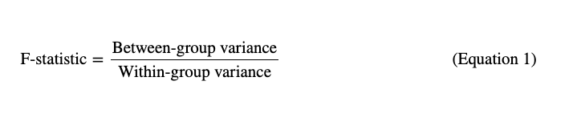
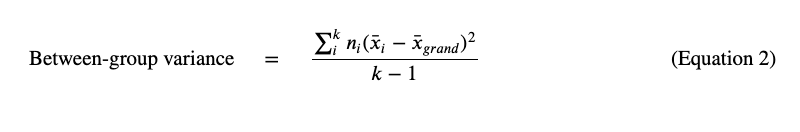
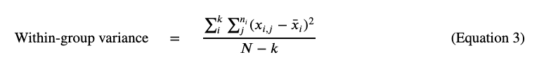

# Part 3: Errors, effect size and statistical power
In this final section, we will take a look at various concepts that are essential to solidifying our grasps on sampling and hypothesis testing. Those are effect size, categorising and quantifying errors, and statistical power -- and the interesting dynamic they have.


## Learning objectives
* Explain the difference between Type I, and Type II errors.
* Explain the concepts of effect size, and statistical 'power' and their dynamic with sample size.
* Explain and interpret ANOVA, its uses and limitations.  

## Errors
Recall that when doing hypothesis testing, we really have one of two decisions to make: either we accept or we reject the Null (H<sub>0</sub>). But what if our conclusion is wrong? Because this is statistics, and we're inherently dealing with uncertainty, the probability that our decision is wrong -- i.e. that we made an error -- is something we should always account for.

Corresponding to the two decisions we could end up making, with any hypothesis test, we can make one of two errors (wrong decisions):

1. We mistakenly reject the Null, when it is true. In other words, we mistakenly conclude that an effect is real, when it is due to chance. This is called a **Type I error**.

2. We mistakenly accept the Null, when it is false. In other words, we mistakenly conclude that an effect is due to chance, when it is actually real. This is called a **Type II error**.

It may be helpful to think of these errors in terms of a matrix of possible decisions:

| | Null is true | Null is false |
| --- |  --- | --- |
|**Null is accepted**| _Correct outcome_ | Type II (β) |
|**Null is rejected**| Type I (α) | _Correct outcome_ |


### Type I
Given that the Null is _true_, the probability of rejecting it is the probability of a Type I error occurring.

Recall from [Part 2](theory2.md) the process for making a decision:
- We want to either accept or reject the Null based on how 'extreme' our result is.
- We define 'extreme' by setting a significance level before we begin testing. Let's say this is 0.05.
- We run our experiment and get some result -- e.g mean difference in our sample between male and female heights is 10cm.
- Assuming the Null is true, the p-value is simply the probability of getting the result that we got, or anything more extreme than it.
- The SL is also a probability -- it's just the probability threshold on which we make our final decision. In fact, it can be thought of as a p-value of 5%.
- If the p-value < SL then we say the result is too extreme to be due to chance and we reject the Null; otherwise we accept it.

If we think of SL as a p-value threshold, then an SL of 0.05 essentially means there is a 5% probability that we would get this result or anything more extreme than it, assuming the Null is the truth -- i.e. the definition of a p-value of 5%. In other words, assuming the Null is the truth, it is the probability of rejecting the Null -- and that is exactly the probability of the Type I error!

> Significance level = Probability of Type I error occurring.<br><br> For e.g if we set a 5% SL, then we're saying there's a 5% chance of getting a Type I error in our statistical test.

Because of this, measuring the Type I error is actually as simple as setting a significance level. The lower we set it, the lower the chances of incorrectly rejecting the Null, or incorrectly thinking our result is real when it's due to random chance. This is especially relevant for sensitive medical applications, where we would want to be very sure that treatment A for instance has an effect that is real, and is not due to chance, so we would lower our SL, and thus the chance of mistaking random chance for a real effect (or being _fooled by randomness_).

Note that Type I error, and the significance level, are also called *alpha* in statistics, denoted by the greek letter α.


### Type II
The Type II error is the other mistake we can make: concluding that we should accept the Null when really we should reject it, i.e. mistakenly thinking the effect is random when it is actually real.

Recall that we accept the Null when the p-value is higher than the SL. First, if we set a higher SL, then the chances of rejecting the Null of course increase, and thus, the chances of incorrectly accepting the Null (i.e. Type II) decrease. However, as mentioned earlier, raising our SL, is the same thing as raising our Type I error!

> In fact, we find there is a trade off between Type I and II errors.<br><br> We can choose to protect ourselves against a Type I error by lowering the SL. However, requiring very strong evidence (i.e. a very low p-value) makes it more likely for us to reject a _true_ Null.<br><br>
Conversely, if we set a higher SL, then our Type I increases as well of course, but since we don't require extreme evidence to reject the Null, the chances of falsely accepting it (Type II) decrease.

In addition to varying our SL, we can also look into adjusting our sample size. A small sample size is less likely to capture meaningful patterns in our data, which means if there is a signifciant difference -- say between male and female heights -- we are less likely to observe that in a small sample than we are in a larger sample. Therefore, as we increase sample size, the chances that we would falsely accept the Null decrease.

The Type II error is often called *Beta* and is denoted by the Greek letter, β.


## Effect size, sample size, and Power
Let's take an example to illustrate what these concepts mean and how they relate to each other. Let's say we wanted to investigate the relationship between gender and salary in our organisation -- i.e. is there a gender pay gap? Our Null hypothesis here would be there isn't a gap (or if there is it's due to random chance), and our Alternate hypothesis would be there indeed is a gap and it's statistically significant. Let's also say we set an SL of 0.05.

Before we begin sampling, it may be worth knowing how much data we want to collect, and why. We don't want to spend lots of effort collecting a sample, only for it to be considered too small, and therefore not meaningful; at the same time, we don't want to spend too much time collecting more data that we don't need. How do we decide on sample size?

First, let's think about the pay gap itself. If there's a big average pay gap, say £20000, then it's quite likely we will spot some significant difference in our sample -- regardless of other factors like position in the company, or location, or any other factor. To spot a big pay gap like £20k we also won't need too big a sample. If on the other hand, we are trying to detect a much smaller gap of say £1000, then we will need much more data.

> Thus, the bigger the difference we are trying to investigate, the higher the probability of our experiment revealing it, and therefore, the less data we need. Conversely, if the actual gap is very small, we would need a much bigger sample to detect it.

Let's translate this back to statistical language:
- The actual gap that we're investigating -- say, £20k -- is called an **effect size**.
- 'Detecting' an effect size, simply means rejecting the Null that there is no difference -- i.e. getting a p-value below 0.05.
- Given a sample, the probability of detecting a specified effect size (like £20k) is called **power**.

The power of a test increases as its sample size increases. Because of this dynamic, we might often start with a specified power, and the effect size we're trying to detect, and work our way to determine how big our sample must be.


#### Power and Type II error
Let's assume the Null is actually false.

The probability of correctly rejecting this false Null would be our statistical power. On the other hand, if we falsely accept it, that would be a Type II error.

Since those two decisions -- accepting or rejecting the Null -- are the only ones we can make with respect to our false Null, their corresponding probabilities should add up to 1. Because of this, power can also be thought of as _1-β_, or 1- the probability of getting a Type II error.


### A note on practice

There are several statistical assumptions and formulae associated with making power calculations, but we won't go into them in this module.

Practically, we might rely on specialised software and online tools (like this [one](https://clincalc.com/stats/samplesize.aspx)) or run the appropriate one line of code in Python! More on the latter in the last (and optional) [section](../5_power.md) of the coding activity.


## Multiple tests 
In the [previous section](theory2.md), we discussed hypothesis tests that evaluate the difference between the means of just two samples. In an A/B test, these might correspond to two homepage designs, or two logos, or two prices for example. But what if we wanted to test more than two groups? What if we wanted an A,B,C test?

One approach we can take is to do multiple two-sample t-tests. For instance, if we wanted to test four logo designs, we could run the following pairwise tests: 

- Logo A and Logo B
- Logo A and Logo C
- Logo A and Logo D
- Logo B and Logo C
- Logo B and Logo D
- Logo C and Logo D

In total, we would end up running 6 tests! The first drawback to this is its complexity: the more logos we want to add to our experiment, the more complex and inevitably confusing the system gets. In fact, the increase in the number of tests we need with higher numbers of groups also increases - for example, with 5 groups, we would need 10 pairwise tests!

The second drawback is to do with statistical error of each experiment. With every test, we run a risk of 0.05 of falsely accepting the Null (assuming the SL is 0.05), or a Type I error, which will compound over 6 tests. Let's take an example to understand this.

> We can take an example to illustrate this effect. <br><br> Assuming an SL of 0.05 at each test (probability of a Type I), then the chance of correctly accepting the Null is 0.95. Therefore, the probability that we correctly accept the Null -- or that we correctly conclude nonsignificance -- for _all_ 6 tests is _0.95 * 0.95 * 0.95 * 0.95 * 0.95 * 0.95 = 0.74_. <br><br> From this, we can easily calculate the probability that we end up falsely rejecting _at least_ one test result, which is simply _1 - (probability that all results are nonsignificant) = 1 - 0.74 = 0.26_. 

To avoid compounding statistical errors and to lower the chances of human error, we can instead opt for tests like the **ANalysis Of VAriance (ANOVA)**. ANOVA answers the question: "are any of the means statistically significantly different from each other?". It generalises the two-sample test for multiple samples. However, crucially, it only tells us _if_ there is a difference between any of the pairs, not _which_ pairs are different. 

> Because ANOVA only tells us if there is a difference in any of the pairs, not where that difference lies, we might want to follow it up with _post-hoc_ tests to investigate a significant result further. 

For the above logo designs example, the Null and Alternative that an ANOVA test will evaluate are as f:

1. **Null, H<sub>0</sub>**: _μ<sub>1</sub>_ = _μ<sub>2</sub>_ = _μ<sub>2</sub>_ = _μ<sub>2</sub>_. <br>
2. **Alternate, H<sub>1</sub>**: _μ<sub>i</sub>_ ≠ _μ<sub>j</sub>_ for any pair of samples _i_ and _j_.


> **A note on the Apprenticeship standard**<br> _There are two ways we can run an ANOVA test: the formulaic way using a statistic, which is equivalent to using t-statistics in the two-sample t-test, and through using permutation tests. This section will address only the first method at a high-level, and show the code required to run the test. This is because as before, permutation tests are above and beyond the curriculum requirements._


### The F-statistic
In order to calculate the p-value and make a decision, the formula-based method would first calculate a statistic called the _F-Statistic_. This value aims to describe how different, or distant, the sample means are from each other. 

The F-statistic is a ratio between two measures of distance: 
1. First, how far each of the sample means is from the mean of the entire dataset. This is called the **_between-group variance_**.
2. Second, an average of how far apart each of the data points are from the mean of their respective sample, across each of the samples. This is called the **_within-group variance_**.

In equation form, this is represented as: 


<br> **Equation 1** -- *The F-ratio, or the F-statistic*.

A high _between-group variance_ means that the sample means are far apart from the mean of the data itself -- called the 'grand mean'. But this doesn't give us the full picture -- perhaps the sample means are really far from the grand mean, but the samples themselves are very spread out, maybe even overlapping each other. We would therefore need some sort of metric in order to gauge how tight or spread out each of the samples are, which is where the within-group variance comes in. But how do we calculate each of those metrics?

To calculate the _between-group variance_, we would need to first calculate the grand mean, and then the mean of each sample. We would then find the difference between each sample mean and said grand mean, square those differences, and multiply each squared difference by its respective sample size. The between-group variance is the average of these values. In equation form, this looks like:



<br> **Equation 2** -- *Between-group variance*.

Equation 2 above looks complicated, but really isn't! Let's break it down:

- _n<sub>i</sub>_ -- the sample size of the _i<sup>th</sup>_ sample.
- _x̅<sub>i</sub>_ -- the mean of the _i<sup>th</sup>_ sample.
- _x̅<sub>grand</sub>_ -- the mean of the entire dataset (all samples together).
- _k_ -- the number of samples.

In the logo design example above, k = 4. We would first calculate each of the sample means (_x̅<sub>1</sub>_ to _x̅<sub>4</sub>_) as well as the grand mean. Then we would find the squared difference between each sample mean and the grand mean and multiply that by the size of the sample in question. We would then sum those values for all the samples and divide by (k - 1).

> _Why k-1? Why not divide by k, like with taking the mean average? We use (k-1) because that's the degrees of freedom for the between-group variance. We won't dig into why that is here, but feel free to read more about this specifically on the [ANOVA Wikipedia page](https://en.wikipedia.org/wiki/One-way_analysis_of_variance#The_hypothesis_test), and the [previous section](theory2.md) for more on what degrees of freedom mean._

To calculate the _within-group variance_ we would first need our sample means as before. We would then calculate the squared difference between each data point and its respective sample mean. We do that for every data point, for every sample, and then sum all those differences together and divide by the degrees of freedom here -- which in this case is _N-k_.


<br> **Equation 3** -- *Within-group variance*.

As before, let's break this down:
- _n<sub>i</sub>_ -- the sample size of the _i<sup>th</sup>_ sample.
- _x̅<sub>i</sub>_ -- the mean of the _i<sup>th</sup>_ sample.
- _x<sub>i,j</sub>_ -- the _j<sup>th</sup>_ data point in the the _i<sup>th</sup>_ sample.
- _k_ -- the number of samples.
- _N_ -- total size of the dataset.


Once we have our F-statistic, we can then find the p-value by looking it up in the appropriate [F-table](http://users.sussex.ac.uk/~grahamh/RM1web/F-ratio%20table%202005.pdf). 

> _We won't get into F-tables here, but the table linked does also have a light decription of how you can use it. Practically, we can rest assured in knowing that all we need is one line of code in Python to calculate the p-value!_

If our F-statistic is high, then that means the variance between the groups is much greater than the variance within the groups -- i.e. we have tight samples that are far away from each other. This would suggest that there is indeed a difference between the sample means, and we are likely to reject the Null. 

Conversely, if we have a low F-statistic -- say, less than 1 -- then that means the variance within the groups is actually greater than that between the groups -- i.e. the samples are very spread out, and they are quite close to the centre of the data. This may indicate that the groups are actually quite similar, and we are likely to accept the Null -- or more technically, we are not likely to have strong enough evidence to reject it.

In practice, as mentioned, one line of code from the `scipy` package in Python is all it takes to run this test:

```python 
# Import the `stats` object from the scipy library
from scipy import stats 

# Use the f_oneway() function to run a one-way ANOVA test
stats.f_oneway(sample_a, sample_b)
```

> **One-way ANOVA vs.Two-way ANOVA vs. MANOVA**<br> Unlike in t-tests, the difference between one-way and two-way ANOVA tests does not refer to whether we care about one or two tails. Instead, it -- not so intuitively -- refers to whether we are dealing with one or two _independent variables_. <br><br> One-way ANOVA involves varying one independent variable -- like logo designs A to D -- and investigating how it affects some dependent variable of interest -- like browsing time. So far this is the technique we discussed -- and it is all we require for the Apprenticeship.<br><br> Sometimes however, we may want to test the effect of more than one independent variable. For example, we could investigate both the effect of logo design and geographical region -- two independent variables -- on our dependent variable. To run an experiment like this, we would need _two-way ANOVA_. <br><br> Finally, if we want to test the effect on two or more _dependent variables_, then we would use an extension of the ANOVA test called MANOVA (or Multivariate ANOVA). Similarly to ANOVA, we can also have _one-way MANOVA_ which investigates the effect of one independent variable on two or more dependent variables, or _two-way MANOVA_ where we investigate the effect of two independent variables on two or more dependent variables. <br><br> We will not go into two-way ANOVA or MANOVA in this module, as it is far above and beyond the requirements of the Apprenticeship standard. However, they are useful to know about as they could come in handy. If you're curious, feel free to use the links below to read further!


## Resource library

### Optional support
[An overview of errors:](http://davidmlane.com/hyperstat/A18652.html)
This article shows a useful table detailing the different potential errors.

[An overview of errors (pt.2):](http://davidmlane.com/hyperstat/A2917.html) 
This is the second half of the article above, on the relationship between errors and sample size. 


### Optional stretch
[Statistical power, Machine learning mastery:](https://machinelearningmastery.com/statistical-power-and-power-analysis-in-python/) 
An article on how to implement statistical power calculations in Python.

[Two-way ANOVA:](https://statistics.laerd.com/spss-tutorials/two-way-anova-using-spss-statistics.php) An article explaning two-way ANOVA, and its assumptions intuitively.

[One-way MANOVA](https://statistics.laerd.com/spss-tutorials/one-way-manova-using-spss-statistics.php) and [two-way MANOVA:](https://statistics.laerd.com/spss-tutorials/two-way-manova-using-spss-statistics.php) These two articles summarise one-way and two-way MANOVA with examples, and clear descriptions of their respective assumptions. 


***

## That's a wrap!
This marks the end of the theory activity. As you will have noticed, there are no challenges in this section. It was designed for use as reference, and as a support piece for both the [coding challenges](./0_brief.md), and for whenever you need to come back to it throughout your journey in the Apprenticeship.

If you have any questions regarding any of the sections, or if you want some go the extra mile in certain areas you're interested in, please reach out to your mentor and they will be best positioned to support your needs.


  <br />

  ___
  [Previous](theory2.md) |  [Back to Theory outline](theory-intro.md)
