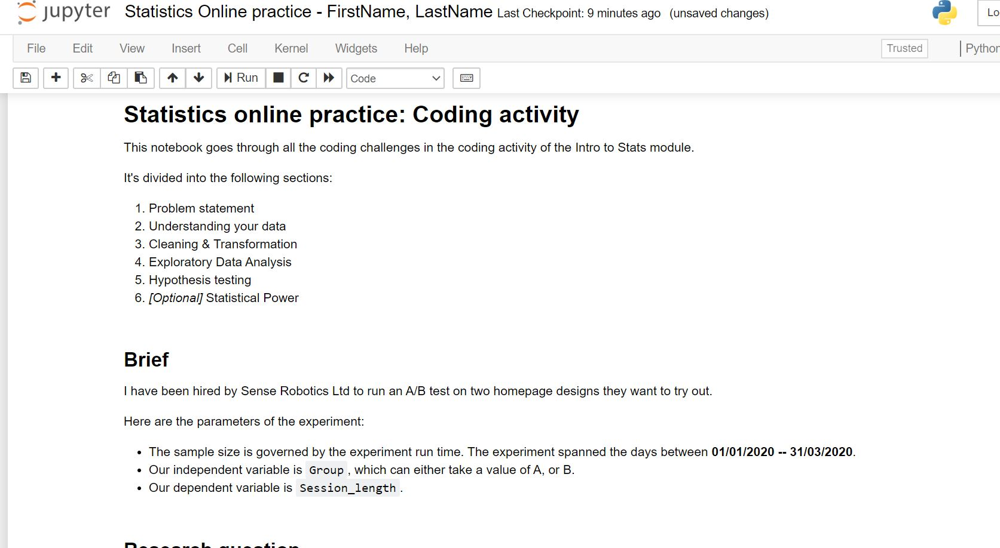
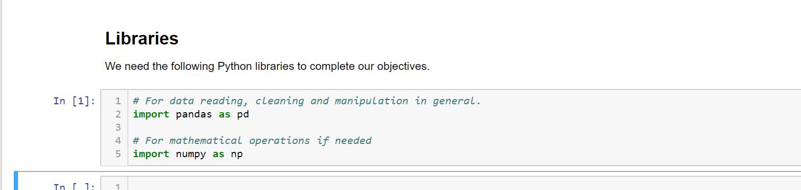

# Walkthrough: Brief
This section walks through the coding challenges given in the [_Outline_](../0_brief.md) section of the activity.

## Challenge 1.0: Set up

- [ ] Open up a blank Jupyter Notebook.
  - [ ] Name the notebook appropriately.
  - [ ] Create a heading, called `Brief`. Underneath, explain the problem at hand.

**Fig 1.** -- *A screenshot of a valid example of setting the scene and explaining the brief.*

For this challenge, Fig. 1 above is only one way you can set the scene. Beyond the essentials, free to add as much colour as you like!

## Challenge 2.0: Research question
- [ ] Write down a valid research question for this problem.

Bearing in mind the few parameters, namely:

-  That it has to be clear. Research questions are meant to clarify what we're trying to do and why, not just to ourselves but to our stakeholders as well.

- That it has to explicitly mention the two variables we're testing -- i.e. the independent variable, `Group` and the dependent variable, `Session_length`.

- That it shouldn't mention 'why'! 'Why' questions are often open-ended, which we don't want. We need only one of two outcomes at the end of the experiment: either the difference is due to chance, or it isn't.

Beyond the above requirements, it's really up to you how you phrase your question. Something like this perhaps:

_**Did changing homepage designs between A and B, significantly affect average browsing session time?**_

Or if you wanted to get more specific:

_**Was there a statistically significant difference between the average session time for users presented with design A, and the average session time for those presented with design B, in Q1 of 2020?**_

## Challenge 3.0: Library set up
- [ ] Create a new heading called `Libraries` and run the following imports:
  - [ ] `import pandas as pd`
  - [ ] `import numpy as np`

**Fig. 2** -- *Screenshot of the libraries cell at this initial stage of the activity.*

We will come back to this cell every time we need to import a new one, depending on our needs. For now, all we need is `pandas` and `numpy`. As with any code block, remember to add in comments for your readers.

   

  ___
  [Next](1_reading.md)
