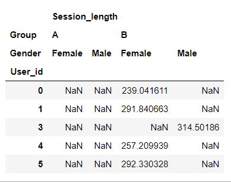
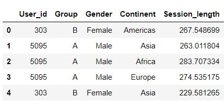

# Walkthrough: Cleaning & Transformation
This section walks through the coding challenges given in the [_Data cleaning and transformation_](../2_cleaning.md) section of the activity.

## Challenge 1: Data cleaning
* [ ] Data Cleaning
  * [ ] Find which column(s) have any NA/Null values.
  * [ ] Investigate those rows specifically and make a decision to either delete them or replace the NAs with something you think is valid. There's no right or wrong answer here, so long as you are able to justify your position.
  * [ ] Explore for any incorrect data in any of the columns.
  * [ ] Handle the incorrect data, if there are any, appropriately.
<br><br>


### Challenge 1.1: Finding the Nulls
We can do this using the `.isnull()` function, which tests whether a given value is a Null or not, returning either a _`True`_  if it is a Null or a _`False`_ if not.

Running the following, will return an entire dataframe of True and False values in the cells.

```python
# .isnull() on the entire dataframe
df.isnull()
```

It's probably more useful though to aggregate those Null values to see where exactly they lie -- if at all -- in our dataset. We can do this aggregation by adding a `.sum()`:

```python
# Null values per column
df.isnull().sum()
```


### Challenge 1.2: Handling the Nulls
The above output tells us there are a total of 8 rows with Null values, and that all those Nulls occur in the `Gender` column. Let's investigate them individually and make our decisions.

To see the subset where the rows of the Gender column are Nulls, we can use the `[]` notation from `pandas`:

```python
# Display the subset of Nulls in our data
df[df['Gender'].isnull()]
```

Since there are only 8 rows, our first instinct might be to just delete them, as they just represent 8/8000 or 0.01%. However, when it comes to making important decisions on samples, we should try to make every row count -- after all, we went through all the trouble of getting them!

We can start by looking the users for which those Null gender values exist. Notice from our subset above that the users are repeated -- e.g we have two sessions that belong to user 99, three to user 150 etc.

Let's investigate each user and see if we can instead infer those Gender values accurately rather than delete them.

```python
# Check user 99
df[df['User_id'] == 99]
```

The above line gives the output below:


<br>**Fig. 1** -- *User 99*.

It seems that this user has been registered as a Male in two sessions and not registered as anything for the two troublesome sessions. With this, we go back to our options:
- Replace those the missing values with 'Male'.
- Treat those rows as errors and remove them.
- Assume this person has chosen not to reveal their gender for those two sessions This is only valid if we assume the user's experience involves them explicitly stating their gender -- we would need to go back to the source (or visit the website ourselves!) to check this assumption. We can assume this isn't the case for now.

> **Note**: Each decision comes with its biases and risks. If we replace with 'Male', we're assuming a system error caused those Null values. On the other hand, If we treat them as faulty data , we are reducing our sample size (albeit not significantly).

Although 8 rows is not much, it seems reasonable here to assume that user 99 is a Male for the two other rows -- perhaps it was due to say, some random system error that we got those Nulls here. In that light, let's go ahead and keep the rows but replace the Null values with 'Male'.

We can use the `.loc` property to tell Pandas which specific cells in our dataframe we are changing.

```python
# We specify the indices in question, and the column name
df.loc[[1063,1075], 'Gender'] = 'Male'

# Note: we get the indices 1063 and 1075 from the subset above.
```

We can now run `df.isnull().sum()` to check they've gone down to 6 Null, and `df[df['User_id'] == 99]` to check we've successfully replaced those Null values with `Male` values.

Now that this user's information is clean, repeat this process for each of the other users: `972`, `765` and `150`.

As before, always check at every step whether the changes you've made have been implemented correctly, before moving on.


### Challenge 1.3: Incorrect data
Recall when exploring our `Session_length` variable, we realised that there were negative session times. This is an example of incorrect data, which we need to treat before moving on.

We can start by exploring how much of this column has negative values. Again, for subsetting we can use the handy `[]` notation:

```python
# Display the subset of the data where the Session length is negative
df[df['Session_length'] <0]
```

The good news is, it seems this hasn't happened often -- we can assume it's probably due to some random error. Let's check how many rows this subset represents:

```python
# How many rows does this subset represent?
df[df['Session_length'] <0].shape
```


### Challenge 1.4: Handling incorrect data
To handle this data, we can either:
- **Replace** it with the mean of the column for example, or better yet, the mean session time for that specific user. _or_
- **Drop** those rows entirely.


As before, making cleaning decisions like this one will affect your data, and your test result, so be sure you're able to reasonably justify the decision you go with.

For simplicity reasons, we will decided to drop those rows.

> _However, if you feel strongly against this, and you feel it's justified to replace with the mean or maybe the median of that column, or of that user, then go ahead and do that!_

We overwrite our `df` to just the rows where `Session_length` is positive:

```python
# Keep only the positive session times in our data
df = df[df['Session_length'] > 0]
```

Great! Now we can double check this has worked by running `.describe()` again and seeing the minimum value.

```python
# Check summary stats
df['Session_length'].describe()
```


## Challenge 2: Data transformation

* [ ] Data transformation
  * [ ] Ensure your data is in 'long' format.
  * [ ] [*OPTIONAL*] Convert the `Date` variable into a _`datetime`_ object using the appropriate function from `pandas`.
  * [ ] Check if the data is at the session level, or at the user level.
  * [ ] If at the session level, group the rows by `User_id`, so that each user only has one associated row, and the `Session_length` variable for that user is averaged across all their sessions.
  * [ ] When grouping the rows, create a new dataframe -- say, `df_grouped` -- for ease.
  * [ ] For this new dataframe, only keep the three columns: `User_id`, `Group`, and `Session_length`. For now, we can put the others to one side.


### Challenge 2.1: Ensure data is in 'long' format
The function that we'll be using later on to run our t-test, takes the data in 'long' format, so we need to double check this is case for us now.


<br>**Fig. 2** - *Wide data - you can think of each column value as a column in and of its own right*.


<br>**Fig. 3** - *Long data - where each row belongs to an observation, be it at the session or at the user level*.

In our case, the data is already in long format, so we don't need to make any transformations to structure.


### Challenge 2.2: *Optional* Convert `Date` variable to _datetime_ object
We can revisit the data types by running the `dtypes` attribute.

```python
# Check data types
df.dtypes
```

Out of curiosity, we can investigate the the `Date` column. We know it holds dates in a string format, but Pandas could also store dates in _datetime_ format, which could be handy if we choose investigate this variable later on.

We can check that it indeed holds strings, by getting a closer look at the first cell:

```python
# Check output of one cell in the Date column
df['Date'][0]
```

And to be more explicit:

```python
# Check type
type(df['Date'][0])
```
​
To change the the `Date` column to a datetime format, we use the *to_datetime()* function from Pandas.

```python
# We use the to_datetime() function on the entire column
df['Date'] = pd.to_datetime(df['Date'])
```

Now we can check what that has done to our data types:

```python
# Check dtypes
df.dtypes
```

And our first cell again:

```python
# Check output of one cell in the new Date column
df['Date'][0]
```

Now that it's in datetime format, we can easily extract specifics, such as the day of the month, the month, or the hour for example.


For instance, we can use the `.year` attribute to extract the year -- 2020 -- from our datetime value.

```python
# Use the .year attribute to get the year
df['Date'][0].year
```

Try `.hour`, or `.day`, or `.month`, or `.dayofweek`!

> You can read more about Timestamp objects and their attributes in the [Pandas documentation](https://pandas.pydata.org/pandas-docs/stable/reference/api/pandas.Timestamp.html).

For the actual experiment, this is unnecessary of course, but it can prove useful for any further directions we may wish to take our research in.


### Challenges 2.3 - 2.6: Session or user level?
It's important to know the level at which we're running our test. Recall from the data cleaning stage, that we found several rows belonging to the same users -- e.g. user 99. This tells us straight away, that each row is a session for that user; the data is at the session level.

Whilst we could leave this as is, at the end of the day we care about the user experience, so it make more sense test on the user level. We're not too interested in the variance between the experiences that the same user had -- especially because each user was only shown one design in our experiment -- so much as their overall experience. For that reason, we aggregate to the user level.

To aggregate the data -- say by taking the average session time for each user -- we could use the handy `groupby()` function from Pandas.

```python
# Use groupby to aggregate our df by ID
df.groupby(by = ['User_id', 'Group']).mean()
```

Notice that we grouped at two 'levels': the `User_id` level first, then by `Group`. We do this to keep the `Group` column in our data!

> _'GroupBy's are best understood by experimentation. Try running the same line of code above but only with `User_id` in the square brackets, or try swapping the levels and see what happens._

We add .mean() at the end to tell it *how* to group the other variables. Since we're adding a `.mean()`, Pandas will apply this only to the numerical features we have -- because you can only find the mean of a numerical feature. In our case, this is just the `Session_length` variable.

> We chose to aggregate by mean, but we can also aggregate in various other ways. Try `.median()`, `.max()` or `.count()` for example.

The end result is this:


<br> **Fig. 4** -- *Grouping by ID first, then by design (A or B). For e.g. the user with the ID of 0, was shown design B and their session time averaged at 239.04 seconds*.

Notice however, since we've chosen to aggregate by taking the mean, that the other variables are no more. We will keep it simple for now, but if we did ever wanted to aggregate different columns by different techniques, then we can use the handy `.agg()` function and pass in a dictionary, like so:

```python
df.groupby(by = 'User_id').agg({'Group': 'max', 'Session_length':'mean', 'Date': 'min'})
```

In the above example, we've chosen to aggregate the `Group` variable by taking its maximum value, the `Session_length` variable by its average, and the `Date` variable by its minimum (i.e the first date that user visited the site). Ideally, we would need to give some thought as to how we could -- or should -- aggregate those columns appropriately.


As mentioned, we will keep it simple for now. Notice that from Fig. 4 above, that we now have two index columns in our new dataframe -- or a _multi-indexed dataframe_. To 'bring them into' our dataframe as actual columns, we can use the `.reset_index()` function.

```python
# Reset index
df.groupby(by = ['User_id', 'Group']).mean().reset_index()
```

Finally, we can assign our new dataframe to a new variable for ease. Say, we call it `df_grouped`:


```python
# New dataframe, new variable
df_grouped = df.groupby(by = ['User_id', 'Group']).mean().reset_index()

# Check first 5 rows:
df_grouped.head()
```


  <br />

  ___
  [Previous](1_reading.md) |  [Next](3_eda.md)
