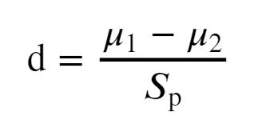
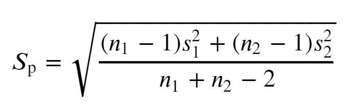

# Walkthrough: Sample size, effect size, and statistical power
This section walks through the coding challenges given in the optional [_Sample size, effect size and statistical power_](../5_power.md) section of the activity.


## Challenge 1:
- [ ] Explain the terms sample size, effect size, and statistical power in your own words, in your notebook.

Sample size, effect size and power are interrelated concepts.

1. **Sample size**: this is the number of rows in a sample. For example sample A has a size of 3902 (after cleaning and transformation).<br><br>

2. **Effect size**: the actual difference between the two sample means. This can be thought of as the absolute difference -- in our case that's 2.12 seconds -- or more commonly, it's the absolute difference divided by the standard deviation. It's more common to standardise effect size like this in order to compare it across samples, and experiments.<br><br>

3. **Power**: The probability of 'detecting' said effect size, i.e. given that the Alternative (H<sub>1</sub>) is TRUE, power is the probability of correctly rejecting the Null (correctly).


> **Power & Type II errors**<br><br>Power is related to the Type II error. Let's assume that the Null is actually FALSE -- i.e. the difference is statistically significant. There are only two decisions we can make here: either we _correctly_ reject the Null, or we _falsely_ accept it. Since these are the only two decisions, their corresponding probabilities will add up to 1.<br><br>
If we correctly reject it, that is our _power_. If on the other hand, we mistakenly accept it, that would be our _Type II error_. Since they add up to 1, we can calculate one of the values using the other. Since we usually want to estimate how likely we are to get a Type II error, the equation we want is _Type II error = 1 - power_.


## Challenge 2: Solving for power
- [ ] Import the `TTestIndPower` object and assign it to a variable, called `tp`.
- [ ] Use the `solve_power()` function from `tp` to calculate the power from your experiment.
  - [ ] Calculate Cohen's *d* measure from your observed difference.
  - [ ] Fill in the parameters appropriately, making sure you set the right one to `None`.
  - [ ] Calculate the Type II error.

All functions we'll be using in this section come from a library called `statsmodels`, which you would need to install before we go any further.

> _As before, if installation is giving you headaches, then please reach out to your mentor and they will be able to help._

From this library we'll be using the handy `TTestIndPower` object, from which we'll be using the `solve_power()` function to make our estimates.

To import this library run the following -- ideally in the Libraries cell for neatness.

```python
from statsmodels.stats.power import TTestIndPower
```

We'll be using the `TTestIndPower` object throughout this section. For ease, it may make sense to store it as a variable we can call on when needed:

```python
# Store it as a variable for ease
tp = TTestIndPower()
```

Sample size, effect size, and power are related mathematically -- in other words, given two, we can calculate the third. For instance, given a desired effect size and power, we can calculate the minimum sample size we need in our experiment. Or, for instance, given the sample size that we have and our desired effect size, what is our power? And from that, what is our estimate for our Type II error? To address either of those questions, we would need to call the `solve_power()` function from the above `tp` variable.

We will go ahead and address scenario 1 first

**Scenario 1. Calculate the power for our results**<br><br>
The parameters of the `solve_power()` function are as follow:
1. `effect_size`: This is our mean difference divided by the standard deviation. Default is _`None`_.
2. `nobs1`: This is the number of observations in sample 1. We don't need to specify the size of the second sample due to the 'ratio' parameter below. Default is _`None`_.
3. `alpha`: This is our significance level.
4. `power`: The probability of correctly rejecting the Null, hence, 'detecting' a statistically significant effect size. Default is _`None`_.
5. `ratio`: The ratio of the size of sample 2 to that of sample 1. In other words, *ratio = Nobs 2/Nobs 1*. Default is _`1`_, i.e. it assumes we have equal sample sizes.
6. `alternative`: Specifies whether our alternate hypothesis is one-tailed or two-tailed. Default is _`two-sided`_.

Since we want to calculate power, we will have to give the function the sample size, and the effect size that we've observed, and keep the `power` parameter at the default _`None`_.

To calculate effect size, let's begin by recalling our observed mean difference:

```python
# Recall the mean difference
(A['Session_length'].mean() - B['Session_length'].mean())

# 2.12 seconds
```

To standardise this, we could effectively just divide by the total standard deviation:

```python
# To get a measure of effect size, we divide the mean difference by the total standard deviation
(A['Session_length'].mean() - B['Session_length'].mean())/df_grouped['Session_length'].std()
```

But this isn't the only way we can standardise. For instance [Glass' Δ](https://en.wikipedia.org/wiki/Effect_size#Glass'_%CE%94) suggests we should divide of the standard deviation of the second sample only, whereas approaches like [Cohen's *d* measure](https://en.wikipedia.org/wiki/Effect_size#Cohen's_d) and [Hedges' *g*](https://en.wikipedia.org/wiki/Effect_size#Hedges'_g) divide by some _pooled_ standard deviation.

Whichever measure we decide on using, we should make sure we mention it in our experiment. For today, we'll be using Cohen's *d* measure, as it's quite popular and there has been quite a bit of work on it. It seems accepted for instance that an effect size, d, of 0.01 or smaller is considered 'very small' whereas if d is 2 or greater, then the effect size is considered 'huge'.

|*d*|Considered|
| --- | --- |
|0.01| Very small |
|0.2| Small |
|0.5|Medium|
|0.8|Large|
|2.0|Huge|

(Based on the works of [Cohen](https://books.google.co.uk/books?id=2v9zDAsLvA0C&pg=PP1&redir_esc=y#v=onepage&q&f=false) and [Sawilowsky](https://digitalcommons.wayne.edu/jmasm/vol8/iss2/26/)).

To calculate Cohen's *d* from our observed difference, we divide it by the pooled standard deviation as expressed in the following equation:

<br>
**Equation 1** -- *Calculating Cohen's 'd' measure*.

Where,
- **μ<sub>1</sub>** is the mean of our first sample;
- **μ<sub>2</sub>** is the mean of our second sample;
- **S<sub>p</sub>** is the pooled standard deviation.

According to the original research, 'pooled standard deviation' is calculated using the following equation:

<br>
**Equation 2** -- *Calculating pooled standard deviation according Cohen's work*.

Where,
- **n<sub>1</sub>** is the size of sample 1.
- **n<sub>2</sub>** is the size of sample 2.
- **s<sub>1</sub>** is the standard deviation of sample 1.
- **s<sub>2</sub>** is the standard deviation of sample 2.

To get 'd' measures out of our mean difference, of 2.12 seconds, we should apply the above.

First, let's get our means and store them as variables for ease.

```python
# Calculating pooled standard deviation and then 'd':

# 1) Create variables for both means. Call them m1, and m2
m1 = A['Session_length'].mean()
m2 = B['Session_length'].mean()
```

Second, let's get our sample size, n<sub>1</sub> and n<sub>2</sub> and again store them in variable for ease.

```python
# 2) Create variables for both sample sizes, n1 and n2
n1 = A.shape[0]
n2 = B.shape[0]
```

And again for our standard deviations, s<sub>1</sub> and s<sub>2</sub>:

```python
# 3) Create variables for both standard deviations, s1 and s2
s1 = A['Session_length'].std()
s2 = B['Session_length'].std()
```

Now we can put all those variables together to calculate our pooled standard deviation.

```python
# 4) Create variable for pooled standard deviation from equation above
sp = np.sqrt(((n1-1)*(s1**2) + (n2-1)*(s2**2))/(n1 + n2 - 2))
```

Finally, we can plug in the right numbers to calculate our *d* effect size:

```python
# 5) Calculate d as the difference between the two means divided by the pooled standard deviation
d = (m1 - m2)/sp

# Print d!
d
```

We get a Cohen's *d* value of **0.084**. For reference, looking back at the table, this is considered a 'very small' effect size.

Now that we have all the necessary parameters for our `solve_power()` function, all we need to do is plug the right values in:

```python
# Use solve_power with the appropriate parameters to estimate. Note, we set 'power' = None.
power = tp.solve_power(effect_size= d,
                       nobs1= n1,  
                       alpha= 0.05,
                       power = None,
                       ratio = n1/n2,
                       alternative= 'two-sided')

# Print power
power
```

We've calculated our power to be **0.976**. In other words, the probability that we'd reject our Null, given that it is in fact false, and hence detect an effect size of 0.084 at an SL of 0.05 is 97.6%.

From this, we can estimate the Type II error of our experiment:

```python
# Type II = 1 - power
t2_error = 1 - power

# Print our Type II error
t2_error
```

The Type II error from our experiment is **2.43%**.


## Challenge 3: Solving for minimum sample size
- [ ] Use the `solve_power()` function to get the minimum sample size required to detect a 'large' effect size with a Type II error of 5%.


We can use the same equation to flip the problem. If we were to start over, with limited resources, or with a need to minimise the time needed to run the experiment, we would need to think about the minimum sample size we'd need for the experiment to succeed.

**Scenario 2. Given a desired effect size, and power, what should our sample size be?**<br><br>

1. **Effect Size**: If we were only interested in a 'large' effect size between the two homepage design, then we'd be eyeing a 'd' value of at least _0.8_.
<br><br>
2. **Power**: This is slightly arbitrary, but will depend on how tolerant we are willing to be against Type II errors. How costly is it to assume that the difference is random, when it is actually statistically significant? There's potentially an opportunity cost of not moving from one design to the other, but it may not be too impactful. In light of this, we may say we're tolerant of no more than a 5% Type II error -- hence, a power of 95%.
<br><br>
3. **Ratio**: For now, let's assume equal sizes for both samples, which gives us a ratio of 1.
<br><br>

With the above and the assumption that we are testing at an SL of 0.05, we can now plug in our values into the `solve_power()` function, whilst setting the `nobs1` parameter to _`None`_ in order to get the minimum sample size.

```python
# Run the same function, but with 'nobs1' = None
min_samples = tp.solve_power(effect_size= 0.8,
                             nobs1= None,
                             alpha= 0.05,
                             power = 0.95,
                             ratio = 1,
                             alternative= 'two-sided')


# Print the number of samples
min_samples
```

**42 people!**

That's all we need in our sample for A. So 84 people in total for both samples, to test a 'large' effect size between our two designs, with a power of 95%.

> _Note: those should be 84 unique users, not sessions!_


## Challenge 4: Experimentation
- [ ] Experiment with this function, noting down what happens when you change:
  - [ ] The effect size,
  - [ ] The SL, and
  - [ ] The power requirement, when keeping everything else constant.


To better understand the dynamic between those parameters, we can tweak one parameter whilst keeping the others constant. For instance, we find that:

- As effect size increases, the minimum sample size required to detect it decreases.
- As our significance level increases, all else being equal, the minimum sample size would need to increase as well.
- As our power requirement increases, so too does the sample size needed to meet it.

There are far many more dynamics to explore. Try out more combinations, for both scenario 1 and 2, and note down what you find!


## *OPTIONAL* Visualising the dynamic
- [ ]  Visualise the dynamic using the `plot_power()` function.

In addition to manual inputs, you can also see the dynamic between the parameters visually using the handy `plot_power()` function, which plots a line graph depicting the relationship between the three parameters, sample size, effect size, and power. Again, we can call this function from the `tp` variable we assigned earlier.

This function takes a few parameters:
- `dep_var` -- this is your dependent variable, or the parameter you're choosing to vary. On the plot, it will be on your X-axis. This can either be your sample size, _`nobs`_ or effect size, _`es`_.
- `nobs` -- The sample size values that will be experimented with.
- `effect_size` -- The effect size values that will be experimented with.

Your X-axis will take whatever parameter you specify in the `dep_var`, and your Y-axis will be your power.

#### Varying sample size
If we wanted to see how varying sample size affected power, we would set the `dep_var` parameter to `nobs`, as that would be our dependent variable. The function also requires us to specify the effect size values -- which in this case is not the main dependent variable, but we will still be varying it for the range of sample sizes.

For example, using the following code to plot the power output when varying the sample size between 2 and 200, for 5 different effect size values.

```python
tp.plot_power(dep_var= 'nobs',
              nobs = np.arange(2,200),
              effect_size = np.array([0.01,0.2, 0.5, 0.8, 2.0]))
```

Let's break the above line down.

First, we know that the `nobs` parameter will be on our X-axis. Since the function will plot a line graph, our X-axis will need to be _continuous_. This means we need to pass in a range of values here.

There are several we can do this in Python. One of them is by using the `arange()` function from `numpy`. The `arange()` function takes three main parameters:

- `start` - the range of values will start with this value.
- `stop` - range of values will end at the value right before this value.
- `step` - the difference between each value and the next in the range. Default is _1_.

In the above line, we specified a numpy array consisting of a range of values starting at 1, and ending at 199, with a step size of 1. The graph we end up tells us how power changes as we increase sample size. We can see, that as sample size increases, so does our power.

In addition to sample size, it might also be interesting to see how the rate of change of power varies with different effect sizes -- i.e. does power increase quicker or slower with sample size, at different effect sizes? We can test a few effect sizes by giving a list of integer values we're curious about.

To create this list or array, we can use numpy again, using the `array()` function this time, which allows us to list our values no matter how far apart or similar they are. In the above line, we simply tried the values from the [table in the previous section](4_htesting.md): 0.01, 0.2, 0.5, 0.8, and 2.0.


#### Varying effect size
If we wanted instead to have effect size as our main dependent variable, then it would be a matter of a simple swap.

First, we would need to set the `dep_var` to effect size -- or `es`. Then, since effect size is now on our X-axis, we need to ensure it's given a range of values through using the `.arange()` function from `numpy`. So far we have a plot that will tell us how power varies as effect size varies. We can then layer on top of that a set of sample sizes to see how quickly or slowly power increases with effect sizes for different sample sizes.

```python
tp.plot_power(dep_var= 'es',
              nobs = np.array([20,40,60,80,100]),
              effect_size = np.arange(0.01,2, 0.01))
```

As before, try out more sample sizes, or more effect sizes - in either of the graphs above - and note down in interesting observations you make!


  <br />

  ___
  [Previous](4_htesting.md) |  [Back to Brief](0_brief.md)
